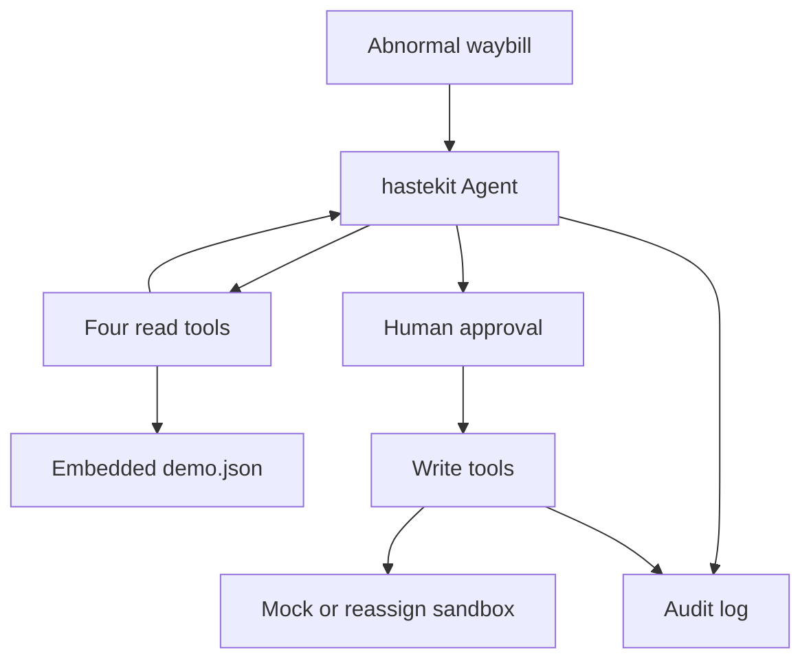

<p align="center">
  English · <a href="README.md">简体中文</a>
</p>

<p align="center">
  <picture>
    <source media="(prefers-color-scheme: dark)" srcset="docs/assets/logo-dark.svg">
    
  </picture>
</p>

<h1 align="center">waybill-guardian</h1>

<p align="center">An agent for abnormal waybills. It gathers evidence, then waits for a person.</p>

<p align="center">
  <a href="https://go.dev/dl/"></a>
  <a href="https://react.dev/"></a>
  <a href="https://nodejs.org/"></a>
  <a href="https://github.com/Duang777/waybill-guardian/issues"></a>
  <a href="https://github.com/Duang777/waybill-guardian/issues/62"></a>
</p>

This repository is an entry in the 传化集团 and 动势科技 architect contest, on the AI + logistics track. The logo is original. It does not use the organizers' marks.

## For judges

After a delay, damage, or loss, waybill-guardian reads the waybill, tracking, driver, and weather, writes an attribution, and proposes reassignment, a claim, or SMS. Write actions do not run before a person confirms them. After confirmation, the server executes them under an idempotency key and appends a replayable audit log.

The agent collects waybill, tracking, driver, and weather evidence before the person decides whether to reassign, open a claim, or send a notice. Reviewers replay the audit by sequence number.

This repository has no measured numbers for time recovered, cost, or labor saved. The three risk scores on the page are constants in [`internal/guardian/service.go`](internal/guardian/service.go): ETA delay 86, road 34, weather 8. They are not calculated metrics.

**The default demo is not online inference.** `AGENT_MODE=demo` uses `ScenarioModel` in [`internal/agent/scenario_model.go`](internal/agent/scenario_model.go). It calls tools in a fixed order. The driver id, route, carriers, and attribution sentence are written in code. [Issue 59](https://github.com/Duang777/waybill-guardian/issues/59) tracks replacing that demo with real model inference.

`AGENT_MODE=online` can call the OpenAI Responses API, or an OpenAI-compatible Chat Completions API. That wiring is in the tree. Issue 59 still asks for a real-model default demo, structured evidence references, and acceptance on a domestic model. Those are not done.

The only waybill is `YD2026101001`, embedded in [`internal/tools/testdata/demo.json`](internal/tools/testdata/demo.json). There is no file import, and there is no way to start an arbitrary waybill. See [issue 60](https://github.com/Duang777/waybill-guardian/issues/60).

The page is a console for that one waybill. There is no network view across highway ports. See [issue 61](https://github.com/Duang777/waybill-guardian/issues/61). The current UI is also not the black and orange command center in [issue 77](https://github.com/Duang777/waybill-guardian/issues/77).

<p align="center">
  
</p>

<p align="center">
  
</p>

Both screenshots come from `npm run verify:e2e` with no Amap key, so the map is the local track. The attribution sentence on the approval card comes from `ScenarioModel`, not from a live model call.

## Architecture



`cmd/server` serves HTTP and SSE. `internal/guardian` connects the agent, approval, idempotency, and recovery. The agent runtime is hastekit `agent-sdk-go` v0.0.24.

The four read tools are `tms.get_waybill`, `tms.get_tracking`, `tms.get_driver`, and `ext.get_road_weather`. They run automatically. The three write tools are `tms.reassign`, `tms.create_claim`, and `notify.send_sms`. They pause until a person decides. The contract is [`contract.yaml`](contract.yaml).

With `PLATFORM=mock`, reads and writes use the embedded fixture. SMS is not actually sent. `PLATFORM=real` starts only with PostgreSQL and JWT. Reads stay on `fixture-v1`. The only write is `tms.reassign`, sent to the HTTP sandbox `tms-reassign-sandbox-v1`. That profile does not register claims or SMS. It exercises a network write and reconciliation. It is not a production TMS, and it is not an official data import.

The default audit is one append-only JSONL file per run, with `seq`, `prev_hash`, and `hash`. With `STORAGE=postgres`, the business projection, audit, and outbox commit in one transaction. The timeline is SSE. Clients resume with `Last-Event-ID`.

Approval starts at `pending`. Confirm moves it to `confirmed`, reject to `rejected`, and timeout to `expired`. All writes succeeding moves it to `executed`. A partial success is `partially_failed`. A total failure is `failed`. An outcome that is not yet known is `reconciliation_required`.

## Features

The status describes code on the current `main` branch.

| Status | Meaning |
|---|---|
| Shipped | It runs on the default branch, within the scope in the notes |
| In progress | Some code exists, and the issue acceptance criteria are not met |
| Planned | The default branch does not have this |

| Feature | Status | Notes |
|---|---|---|
| Four read tools, three write tools, human approval | Shipped | Matches [`contract.yaml`](contract.yaml). Under mock, all three writes require approval. |
| Server-generated idempotency key | Shipped | The model does not submit `effect_id` or the key. Ten concurrent calls for one key reach the platform once. See [`idempotency_test.go`](internal/idempotency/idempotency_test.go). |
| JSONL audit, hash chain, SSE replay | Shipped | The UI deduplicates by run and `seq`. |
| PostgreSQL storage | Shipped | Stores runs, approvals, effects, audit, outbox, and AES-256-GCM agent history. |
| Local identity and JWT | Shipped | `AUTH_MODE=local` listens on loopback only. `jwt` checks RS256, issuer, audience, time, tenant, role, and waybill scope. |
| Amap or a local track | Shipped | With no key, or if the SDK fails to load, the page draws local coordinates. |
| Reassign HTTP sandbox | Shipped | `tms.reassign` only. Reads stay on the fixture. Not a production TMS. |
| Online model calls | In progress | An OpenAI-compatible API can be configured. The default demo is still the script. See [issue 59](https://github.com/Duang777/waybill-guardian/issues/59). |
| File import and arbitrary waybills | Planned | [Issue 60](https://github.com/Duang777/waybill-guardian/issues/60) |
| Highway-port overview | Planned | [Issue 61](https://github.com/Duang777/waybill-guardian/issues/61) |
| LICENSE file | Planned | [Issue 62](https://github.com/Duang777/waybill-guardian/issues/62) |
| CSRF checks on non-GET requests | Planned | [Issue 64](https://github.com/Duang777/waybill-guardian/issues/64) |
| Docker Compose | Planned | [Issue 65](https://github.com/Duang777/waybill-guardian/issues/65) |
| GitHub Actions | Planned | [Issue 67](https://github.com/Duang777/waybill-guardian/issues/67). There is no workflow yet, so this page has no CI badge. |
| Command-center visual design | Planned | [Issue 77](https://github.com/Duang777/waybill-guardian/issues/77), including issues 69 through 76. |

## Demo

The script is [`docs/demo-script.md`](docs/demo-script.md). Start the stack:

```bash
./scripts/demo.sh
```

Open <http://127.0.0.1:5173> and click **启动演示**.

1. The agent reads waybill `YD2026101001`, Hangzhou to Chengdu.
2. The timeline records waybill, tracking, driver, and weather calls.
3. The script attributes the delay to 9 hours of continuous driving and a 6 hour stop at 绵阳北服务区, with clear weather. It pauses on an approval card: reassign to 川行快运, then notify the shipper and the driver. Those writes have not run yet.
4. Click **确认并执行**. The timeline shows the platform writes, and the waybill status becomes completed.
5. Use the replay control to watch from the first audit event, then click **实时** to return to the live end.
6. If the first carrier is rejected, the script proposes 蜀道联运. `npm run verify:e2e` covers three confirmations and one rejection.

A subtitled recording with no audio track:

```bash
cd web
npm run record:demo
```

The file is `web/artifacts/waybill-guardian-demo.mp4`, at 1600 by 900. That directory is gitignored. A dubbed narration is not in the repository. `RECORD_OUTPUT`, `RECORD_BACKEND_PORT`, and `RECORD_WEB_PORT` change the output path and ports.

## Quick start

You need Go 1.25.3 or newer, and Node.js 22.12 or newer. This check used Go 1.25.3 and Node.js 22.14.0. `./scripts/demo.sh` brought up the API and the web console, and `npm run verify:e2e` passed.

```bash
git clone https://github.com/Duang777/waybill-guardian.git
cd waybill-guardian
./scripts/demo.sh
```

If `web/node_modules/.bin/vite` is missing, the script runs `npm ci`, then builds the API and starts the web console. When both are up it prints `Waybill Guardian is ready`. `Ctrl+C` stops both processes.

Use another port and data directory:

```bash
BACKEND_PORT=18080 WEB_PORT=15173 DATA_DIR=/tmp/waybill-demo ./scripts/demo.sh
```

Checks:

```bash
go test ./...
go test -race ./...
go vet ./...
go build ./...
./scripts/check-history-governance.sh
```

`./scripts/test-postgres.sh` starts a temporary PostgreSQL 17 with Docker and checks migrations, transactions, leases, and encrypted history.

```bash
cd web
npm ci
npm test
npm run build
npm run verify:e2e
```

## Configuration

`./scripts/demo.sh` sets the first four variables below. Every other variable is inherited from the shell. `go run ./cmd/server` listens on `HTTP_ADDR`, default `127.0.0.1:8080`.

| Variable | Default | Meaning |
|---|---|---|
| `BACKEND_HOST` | `127.0.0.1` | API host, used by `demo.sh` |
| `BACKEND_PORT` | `8080` | API port, used by `demo.sh` |
| `WEB_HOST` | `127.0.0.1` | Web host, used by `demo.sh` |
| `WEB_PORT` | `5173` | Web port, used by `demo.sh` |
| `HTTP_ADDR` | `127.0.0.1:8080` | Server listen address. Local mode requires a loopback IP |
| `DATA_DIR` | `data` | JSONL audit and hastekit history directory |
| `AGENT_MODE` | `demo` | `demo` uses `ScenarioModel`. `online` calls an external model |
| `PLATFORM` | `mock` | `mock` uses the fixture. `real` uses the reassign sandbox |
| `STORAGE` | `jsonl` | `jsonl` or `postgres` |
| `AUTH_MODE` | `local` | `local` or `jwt` |
| `APPROVAL_TTL` | `10m` | Approval lifetime, Go duration. An invalid value falls back to the default |
| `HISTORY_RETENTION` | `168h` | Retention for finished agent history. Must be positive |
| `DEMO_STEP_DELAY` | `220ms` | Pause between scripted model steps |
| `TENANT_ID` | `local-demo` | Required explicitly in JWT mode |
| `INSTANCE_ID` | random UUID | Worker identity on PostgreSQL leases |

### Online model

```bash
AGENT_MODE=online \
LLM_API_STYLE=responses \
LLM_BASE_URL=https://api.openai.com/v1 \
LLM_API_KEY=replace-me \
LLM_MODEL=gpt-5-mini \
./scripts/demo.sh
```

`LLM_API_STYLE` is `responses` or `chat_completions`. The default is `responses`. `LLM_BASE_URL` must be the API root. It must not end in `/`, and it must not include `/responses` or `/chat/completions`. Online mode configures one provider and does not enable provider fallback. A model call is attempted at most three times, including the first try.

This is still not the real-model default demo in issue 59.

### Platform

`PLATFORM=mock` does not call an external system.

`PLATFORM=real` also requires:

| Variable | Required value |
|---|---|
| `STORAGE` | `postgres` |
| `AUTH_MODE` | `jwt` |
| `REAL_PLATFORM_PROFILE` | `tms-reassign-sandbox-v1` |
| `REAL_READ_SOURCE` | `fixture-v1` |
| `TMS_SANDBOX_BASE_URL` | Sandbox root URL |
| `TMS_SANDBOX_TOKEN` | Bearer token |
| `TMS_SANDBOX_ACCOUNT` | Must equal `TENANT_ID` |

Related timeouts are `PLATFORM_REQUEST_TIMEOUT` (default `3s`), `PLATFORM_STARTUP_TIMEOUT` (default `5s`), `EFFECT_RECONCILE_HORIZON` (default `24h`), `EFFECT_RECONCILE_POLL_INTERVAL` (default `1s`), and `PLATFORM_MAX_LOOKUP_CONSISTENCY_WINDOW` (default `30s`).

### Storage, auth, and outbox

`STORAGE=postgres` requires `DATABASE_URL` and `CHECKPOINT_ENCRYPTION_KEY`. The key is a Base64 encoding of 32 bytes for AES-256. `CHECKPOINT_KEY_ID` defaults to `local-v1`.

Pool settings: `PG_MAX_CONNS` defaults to 8, `PG_MIN_CONNS` defaults to 0, `PG_STARTUP_TIMEOUT` defaults to `30s`. `RUN_LEASE_TTL` defaults to `30s`. `EFFECT_LEASE_TTL` defaults to `15s`.

`AUTH_MODE=jwt` also needs `AUTH_JWT_ISSUER`, `AUTH_JWT_AUDIENCE`, and `AUTH_JWT_PUBLIC_KEY_FILE`. The public key is a PEM-encoded RSA key. The JWT needs `sub`, `tenant_id`, `roles`, and either `waybill_all=true` or a non-empty `waybill_ids`. Roles are `viewer`, `dispatcher`, `operator`, and `event_producer`. The server does not terminate TLS. A non-loopback deployment needs an HTTPS front door.

`POST /v1/events` is registered only in PostgreSQL mode. The outbox dispatcher is off by default. `OUTBOX_ENABLED=true` requires `OUTBOX_URL` and `OUTBOX_TOKEN`. Except for a loopback test address, `OUTBOX_URL` must be HTTPS. `METRICS_ADDR`, for example `127.0.0.1:9090`, exposes Prometheus metrics at `/metrics` on a separate listener. Both require PostgreSQL.

| Variable | Default |
|---|---|
| `OUTBOX_BATCH_SIZE` | `10`, maximum 100 |
| `OUTBOX_CONCURRENCY` | `4`, maximum 100 |
| `OUTBOX_POLL_INTERVAL` | `250ms` |
| `OUTBOX_LEASE_TTL` | `30s` |
| `OUTBOX_STATS_INTERVAL` | `15s` |
| `OUTBOX_HTTP_TIMEOUT` | `10s` |

### Web

Put Amap settings in `web/.env.local`. Git ignores that file.

```dotenv
VITE_AMAP_KEY=replace-me
VITE_AMAP_SECURITY_JS_CODE=replace-me
```

`VITE_API_TARGET` is the API address for the Vite dev proxy. The default is `http://127.0.0.1:8080`. `demo.sh` sets it to the API it started.

### Delete agent history

Stop the server first. Delete local history:

```bash
rm -rf "${DATA_DIR:-data}/hastekit"
```

PostgreSQL deletion is per tenant. It also clears checkpoint pointers on finished runs:

```sql
BEGIN;
DELETE FROM waybill.agent_summaries WHERE tenant_id = :'tenant_id';
DELETE FROM waybill.agent_checkpoints WHERE tenant_id = :'tenant_id';
UPDATE waybill.runs
SET sdk_run_id = NULL, checkpoint_version = 0
WHERE tenant_id = :'tenant_id'
  AND status IN ('completed', 'rejected', 'failed', 'manual_review');
COMMIT;
```

Do not clear a run that is still active. Deleting history does not delete `waybill.audit_events`.

## Safety and compliance

Write tools set `RequiresApproval`. hastekit pauses the run at `await_approval` before the tool runs. The human decision is written to the audit first. The server then resumes the same thread. Confirm, reject, and expiry share one run lock, so only one decision is stored. Expiry resumes the agent as a rejection. The default lifetime is 10 minutes.

The model submits business arguments only. The server generates `effect_id` and the idempotency key. On resume, middleware checks `call_id`, the argument hash, and `effect_id`. Concurrent calls for the same key are merged. In the test, 10 concurrent calls reach the platform once. A recorded failure can be retried as a new attempt. If the external system succeeded and the local success event was not written, the state is indeterminate and the server does not retry automatically. A real adapter must retry safely with the same key, or look the key up.

Audit events are append-only. `seq`, `prev_hash`, and `hash` let a reader check that the chain was not edited. SSE replays from the cursor, then streams live events.

The read-tool payloads sent to the model omit phone numbers, license plates, and exact coordinates. The SMS tool receives the waybill, the recipient role, and the carrier. The server resolves the phone number and template after approval. The history guard rejects phone numbers, license plates, exact coordinates, and SMS provider parameters in model history. The operator API masks phone numbers and license plates. The map API still returns track coordinates so the console can draw the route.

`AUTH_MODE=local` accepts only a loopback IP, and it rejects a request whose Host is not a loopback IP. The approval subject is fixed as `local-demo-reviewer`. A client-supplied `Authorization` header or `X-Actor` header does not choose the identity.

Non-GET routes do not yet check `Origin` or `Sec-Fetch-Site`. See [issue 64](https://github.com/Duang777/waybill-guardian/issues/64).

## Open source

Direct dependencies, npm packages, and reference projects are listed in [`THIRD_PARTY_NOTICES.md`](THIRD_PARTY_NOTICES.md).

hastekit `agent-sdk-go` v0.0.24 is a Go module dependency under Apache-2.0. This repository does not copy its source.

These three projects were used to compare interaction and domain splits. None of their source files are in this repository:

- [jattiphrswan/logistics-tracker](https://github.com/jattiphrswan/logistics-tracker)
- [09karankr/port-logistics-intelligence](https://github.com/09karankr/port-logistics-intelligence)
- [dominicfinn/open_tms](https://github.com/dominicfinn/open_tms)

## Roadmap

| Issue | Topic |
|---|---|
| [59](https://github.com/Duang777/waybill-guardian/issues/59) | Run the demo on a real model, with structured evidence references |
| [60](https://github.com/Duang777/waybill-guardian/issues/60) | File import, and start any waybill |
| [61](https://github.com/Duang777/waybill-guardian/issues/61) | Highway-port overview and KPIs that can be checked |
| [62](https://github.com/Duang777/waybill-guardian/issues/62) | Choose and add a LICENSE |
| [64](https://github.com/Duang777/waybill-guardian/issues/64) | CSRF checks for non-GET requests |
| [65](https://github.com/Duang777/waybill-guardian/issues/65) | Docker Compose |
| [67](https://github.com/Duang777/waybill-guardian/issues/67) | GitHub Actions |
| [68](https://github.com/Duang777/waybill-guardian/issues/68) | Judge-facing README. This page adds the diagram, the boundaries, and the demo entry. Measured KPIs, official-data steps, and a dubbed video are still open |
| [77](https://github.com/Duang777/waybill-guardian/issues/77) | Frontend visual work, including issues 69 through 76 |

The production handling path is [issue 44](https://github.com/Duang777/waybill-guardian/issues/44).

The social preview image is [`docs/assets/social-preview.png`](docs/assets/social-preview.png), at 1280 by 640. GitHub's repository Social preview is a separate upload. This file does not become that image by itself.

## License

This repository has no `LICENSE` file, and no open-source license has been chosen. See [issue 62](https://github.com/Duang777/waybill-guardian/issues/62). Until that file lands, do not treat this repository as granted under an OSI license.

Third-party component licenses are in [`THIRD_PARTY_NOTICES.md`](THIRD_PARTY_NOTICES.md).

## Further reading

- Architecture and recovery: [docs/RFC-001.md](docs/RFC-001.md)
- Real platform adapter: [docs/RFC-002.md](docs/RFC-002.md)
- Reassign sandbox: [docs/real-write-adapter-design.md](docs/real-write-adapter-design.md)
- Agent history: [docs/history-governance.md](docs/history-governance.md)
- Module index: [AGENTS.md](AGENTS.md)
