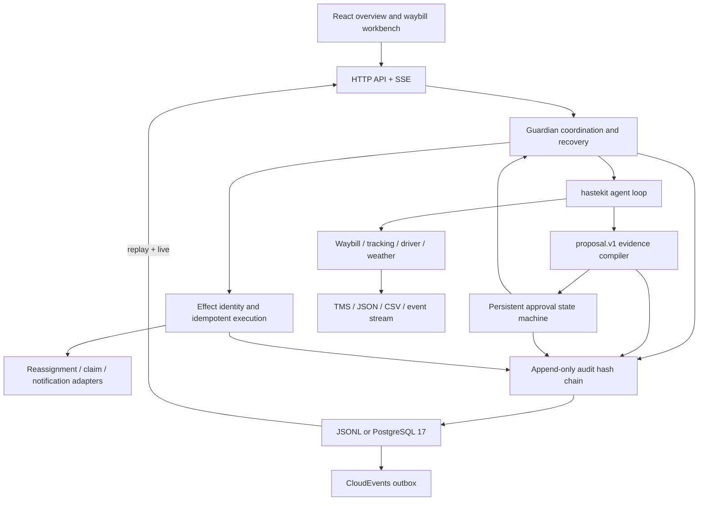

<p align="center">
  English · <a href="README.md">简体中文</a>
</p>

<p align="center">
  <picture>
    <source media="(prefers-color-scheme: dark)" srcset="docs/assets/logo-dark.svg">
    
  </picture>
</p>

<h1 align="center">waybill-guardian</h1>

<p align="center">An evidence-driven agent for abnormal waybills. Automated investigation, human decisions, idempotent execution, and complete auditability.</p>

<p align="center">
  <a href="https://go.dev/dl/"></a>
  <a href="https://react.dev/"></a>
  <a href="https://nodejs.org/"></a>
  <a href="https://github.com/Duang777/waybill-guardian/actions/workflows/ci.yml"></a>
  <a href="LICENSE"></a>
</p>

Entry for the AI + Logistics track of the 传化集团 and 动势科技 AI Architecture Competition.

## For judges

When a shipment is delayed, damaged, or lost, waybill-guardian gathers waybill, tracking, driver, and weather evidence. It calculates risk, produces attribution with traceable citations, and proposes reassignment, claims, or notifications. Every write action enters human approval first. After confirmation, the server derives a stable effect identity and idempotency key, executes the platform write, and records the complete process as verifiable, resumable, and replayable audit events.

<p align="center">
  <a href="https://github.com/Duang777/waybill-guardian/releases/download/demo-v1.0.0/waybill-guardian-demo-1920-zh.mp4"><strong>Watch the 60-second narrated demo</strong></a>
  ·
  <a href="docs/demo-script.md">Read the three-minute script</a>
  ·
  <a href="contract.yaml">Inspect the tool contract</a>
</p>

<p align="center">
  
</p>

### One complete disposition loop

| Phase | System action | Constraint | Verifiable evidence |
|---|---|---|---|
| Detect | Accept an anomaly event or an operator-selected waybill | Authorization scope is applied before aggregation and disposition | CloudEvent, waybill scope, event hash |
| Investigate | Call waybill, tracking, driver, and weather read tools | Every read is bound to the current waybill, driver, and route | Arguments, result summary, evidence fields |
| Attribute | Calculate delay, road, and weather risk and compile attribution | Every factor cites an audited tool field | Confidence, JSON Pointer, event sequence, hash |
| Propose | Produce reassignment, claim, and notification candidates | A carrier must exist in current waybill evidence | Summary, alternatives, write set |
| Decide | Move a `pending` approval to confirmed, rejected, or expired | Persist the human decision before resuming the same agent thread | Actor, reason, timestamp, plan version |
| Execute | Call a platform adapter by stable effect identity | Coalesce concurrent copies and replay successful results | Effect, attempt, receipt, response digest |
| Recover | Rebuild runs, approvals, and effects at startup | Query uncertain external outcomes before any retry | Lookup result, recovery decision, review state |
| Review | Stream live SSE events and resume from a cursor | Deduplicate by run and `seq` | `seq`, `prev_hash`, `hash` |

The model interprets evidence and organizes the plan. The server owns identity, authorization, approval, execution, recovery, and audit. A model cannot create its own effect identity, cite missing evidence, or bypass approval.

## Core algorithms

### Multi-source risk scoring

The service reads the waybill, tracking points, driver state, and route weather in a fixed sequence. It calculates three scores from 0 to 100 before the model explains the evidence.

```text
ETA risk =
  clamp(
    20 when the shipment is not delivered
    + anomalous tracking points × 15
    + anomalous stop hours × 8,
    0,
    100
  )

Road risk =
  clamp(
    continuous driving hours × 5
    + fatigue alert 30,
    0,
    100
  )

Weather risk =
  no alert 0
  blue or yellow 30
  orange 60
  red or critical 90

Composite risk = ETA risk × 50% + road risk × 30% + weather risk × 20%
```

The overview ranks anomalous waybills by composite risk, then by the latest recorded timestamp. The implementation is in [`internal/guardian/assessment.go`](internal/guardian/assessment.go) and [`internal/guardian/overview.go`](internal/guardian/overview.go).

### Evidence-constrained agent inference

The runtime uses hastekit `agent-sdk-go` v0.0.24 and applies middleware at every model and tool boundary:

- Capability filtering exposes only actions enabled by the deployment.
- Read binding requires the current waybill, driver, and route.
- One logical model call has a 45-second budget and a 4096-token output limit.
- The agent loop is capped at 20 iterations, with at most three provider attempts.
- Audit events record the model, API style, latency, token use, outcome, and issue codes.
- Tool outputs use allow-listed fields with bounded strings, arrays, and history.

The provider can expose either a Responses-compatible or Chat Completions-compatible API.

### Compiled structured proposals

Model output must pass the `proposal.v1` compiler before approval:

1. JSON uses strict decoding with no unknown fields, duplicate keys, or trailing values.
2. Every attribution contains confidence and between one and eight evidence references.
3. Every reference uses an RFC 6901 JSON Pointer into a tool result from the same run.
4. The quoted scalar must match the audited value byte for byte.
5. A citation retains its source event ID, `seq`, and `hash`.
6. All four read tools must have succeeded.
7. Every proposed carrier must exist in the latest waybill evidence.
8. An impact field that the tools cannot prove must be `unavailable`.

If the first proposal fails, the system sends the issue code and a bounded failure excerpt through one repair call. A second failure moves the run to human review. See [`internal/proposal`](internal/proposal) and [`internal/agent/proposal_middleware.go`](internal/agent/proposal_middleware.go).

### Persistent human approval

Write tools declare `RequiresApproval`. The agent pauses before execution, and the server stores the arguments, evidence, alternatives, and expiry as one approval batch.

```text
pending ──confirm──> confirmed ──all succeeded──> executed
   │                      ├──partial failure──> partially_failed
   │                      └──uncertain result──> reconciliation_required
   ├──reject──> rejected
   └──timeout──> expired
```

Confirmation, rejection, and expiry contend for the same run lock, so only one decision is accepted. Expiry resumes the agent as a rejection. A rejection reason returns to the same thread and can produce a new plan.

### Stable effect identity and concurrency control

The model submits business arguments only. The server derives execution identity:

1. Canonicalize the argument JSON and hash it with SHA-256.
2. Derive a proposal UUID from `run_id`, `incident_id`, `waybill_id`, and `plan_version`.
3. Hash the action, target, and argument hash into a proposal item.
4. Derive a stable `effect_id` from the proposal and item identities.
5. Derive a 256-bit idempotency key from the `effect_id`.

Concurrent calls with the same key wait for one execution. A successful result is replayed. A key reused with different business arguments is rejected. The concurrency test sends ten calls and reaches the platform once. See [`internal/idempotency/idempotency_test.go`](internal/idempotency/idempotency_test.go).

If an external write may have succeeded before the local success event was committed, the effect enters `unknown`. Recovery queries the external system by key before it chooses completion, retry, waiting, or human review.

### Append-only audit hash chain

Each run owns an append-only event stream. Every event includes a monotonic `seq`, stable `event_id`, actor, type, redacted payload, `prev_hash`, and current `hash`.

The hash covers canonical event content and the previous hash. Startup verification checks sequence continuity and the complete chain. JSONL storage uses a single-writer lock, file `fsync`, and directory `fsync`. PostgreSQL commits the business projection, audit event, and outbox row in one transaction.

SSE sends events after `Last-Event-ID` before switching to live delivery. A reconnect resumes from the last sequence without rerunning the agent.

### Order-independent CloudEvents reduction

`POST /v1/events` accepts CloudEvents 1.0 structured JSON. The boundary validates the schema, UTF-8, timestamps, source URI, subject, source version, and body size. Equivalent JSON produces the same canonical hash.

The reducer is independent of input order. It applies replace and retract corrections by `source_version` and produces `active`, `retracted`, `pending_correction`, or `conflicted`. Conflicting versions, cross-incident corrections, missing targets, and invalid version relations retain evidence and move to human review.

The outbox dispatcher uses leases, renewal, bounded concurrency, and capped exponential backoff.

### Verifiable operating metrics

The overview filters by JWT waybill scope before calculating metrics. Missing facts are never replaced by default averages.

| KPI | Formula |
|---|---|
| Realized time recovery | Includes only completed runs with a matching human confirmation and system execution |
| Realized cost impact | `avoided penalty - reassignment delta - handling cost`, summed as integer cents |
| Labor saved | `successful evidence steps × EVIDENCE_STEP_MINUTES ÷ 60` |
| Anomaly closure rate | `completed or rejected anomalous waybills ÷ anomalous waybills in the window` |
| Average handling time | Average of `terminal time - start time` |
| Human approval rate | `human confirmations ÷ human decisions` |

Incomplete inputs return `unavailable` with a reason. Executive briefs receive identity-free aggregate counts, and the server reconstructs their citations.

## City delivery planning and loading

The repository has a separate `delivery` domain. Multi-order planning state does not enter the
single-waybill disposition aggregate. The committed foundation includes:

- Typed `delivery.problem.v1`, `delivery.plan.v1`, and `delivery.validation.v1` contracts.
- Frozen fact snapshots, canonical JSON, and bound problem, policy, commitment, plan, and report
  digests.
- Thirteen independent Validator rule families for order conservation, pickup and delivery,
  resources, routes, time windows, driver regulations, energy, three-dimensional bounds, support,
  unloading access, axle loads, center of gravity, commitments, and recomputed metrics.
- A content-addressed artifact store that verifies the digest and canonical envelope on reads.
- A delivery console that synchronizes routes, driver timelines, state of charge, and staged
  three-dimensional loading with approval, effects, and reconciliation.
- A fixed-seed benchmark command that can invoke the built-in solver, VROOM, OR-Tools, and PyVRP
  commands.

The authoritative report uses datasets with 8, 32, and 128 requests, which contain 16, 64, and 256
tasks. The deterministic reference baseline runs 20 replays per dataset. Every plan has zero hard
violations, and both the plan digest and validation report digest remain stable. The complete run
records, machine details, timings, and publication gate are in
[`delivery-benchmark.v1.json`](docs/reports/delivery-benchmark.v1.json). The generated table is in
the [city delivery benchmark evidence](docs/reports/delivery-benchmark.en.md).

```bash
./scripts/delivery-benchmark/run.sh
./scripts/delivery-benchmark/check.sh
```

The reference baseline verifies the data, digests, Validator, and reporting path. It does not
measure production solver quality, prove global optimality, or certify physical loading safety.
Publish production solver evidence only when `publication_gate.publication_ready=true`.

## Architecture



## Product capabilities

| Area | Implemented capability |
|---|---|
| Nationwide overview | 72 hubs, route heat, vehicle state, six KPIs, three operating charts, and executive briefs |
| Anomaly queue | Risk ranking, status filters, batch selection, and up to 20 run starts per request |
| Waybill workbench | Six-stage progress, route map, anomaly points, evidence ledger, approval, and audit timeline |
| Agent investigation | Four read tools, call audit, target binding, capability filtering, budgets, and retries |
| Disposition actions | TMS reassignment, damage or loss claims, and shipper or driver notifications |
| Human decisions | Confirm, reject, reason feedback, expiry, and alternative plans |
| Reliable execution | Server-owned effect identity, concurrent coalescing, result replay, and reconciliation |
| Recovery | Approval recovery, proposal checkpoints, effect recovery, and history retention |
| Audit | Hash verification, SSE cursor resume, timeline replay, and redaction |
| Integration | JSON or CSV v1, CloudEvents 1.0, and TMS and notification adapter boundaries |
| Authorization | Restricted local access, JWT RS256, tenant, role, and waybill scope |
| Persistence | JSONL, PostgreSQL 17, AES-256-GCM agent history, and transactional outbox |
| Observability | Bounded-label Prometheus metrics, model latency and tokens, and outbox statistics |
| Frontend | White industrial console, responsive layouts, charts, and Amap integration |
| City delivery foundation | Typed planning contracts, independent Validator, artifact store, 20 deterministic replays, and delivery console |

<p align="center">
  
</p>

<p align="center">
  
</p>

## Reliability evidence

| Scenario | Behavior | Automated evidence |
|---|---|---|
| Ten concurrent copies of one effect | The platform executes once | `TestConcurrentExecuteRunsEffectOnce` |
| Concurrent approval decisions | One decision wins through the run lock and state machine | `TestConcurrentConfirmResumesRunOnce`, `TestDecisionConflict` |
| Restart after confirmation | The same agent thread resumes | `TestRecoverReplaysConfirmedApproval` |
| Proposal committed before approval creation | Approval is materialized without another model call | `TestRecoverUsesPreparedProposalWithoutCallingModelAgain` |
| Uncertain external write | Recovery performs lookup instead of duplicate dispatch | `TestRecoverReconcilesStartedEffectWithoutStoppingService` |
| One damaged run | The damaged run is quarantined while healthy runs recover | `TestPrepareRecoveryQuarantinesOnlyDamagedRun` |
| SSE reconnect | Delivery resumes after `Last-Event-ID` | `TestHTTPDemoFlowAndSSECursor` |
| Correction before its target | The reducer converges regardless of order | `TestReduceCorrectionBeforeTargetConverges` |
| Invalid model citation | Proposal compilation fails and routes to repair or review | `internal/proposal/proposal_test.go` |
| Sensitive agent history | The persistence boundary rejects it | `internal/agent/history_guard_test.go` |

GitHub Actions runs Go, race, Web, PostgreSQL 17, recovery stability, license, and container checks for pull requests and `main`.

## Demo

Configure any compatible Responses or Chat Completions provider:

```bash
export LLM_API_STYLE=chat_completions
export LLM_BASE_URL=https://api.deepseek.com
export LLM_API_KEY=replace-me
export LLM_MODEL=deepseek-v4-flash
./scripts/demo.sh
```

Open <http://127.0.0.1:5173>.

1. Select anomalous waybills in the operating overview and click **交给 Agent**.
2. The agent queries four evidence sources while the page streams six-stage progress.
3. The evidence ledger exposes continuous driving, anomalous stops, and weather alerts.
4. The approval card lists carriers, ranking reasons, and pending writes.
5. Click **确认并执行** to resume the same thread and execute by effect identity.
6. Open **完整审计记录**, replay from the first event, then return to **实时**.
7. Start again and reject the first plan. The agent reads the reason and proposes another carrier.

The published [1920 by 1080 narrated demo](https://github.com/Duang777/waybill-guardian/releases/download/demo-v1.0.0/waybill-guardian-demo-1920-zh.mp4) includes Chinese captions and a synthesized voice track. The script is in [`docs/demo-script.md`](docs/demo-script.md#60-秒配音稿).

Generate a recording:

```bash
cd web
npm run record:demo
```

Generate a 1920 by 1080 recording:

```bash
RECORD_RESOLUTION=1920x1080 npm run record:demo
```

## Quick start

You need Go 1.25.3 or newer and Node.js 22.12 or newer.

```bash
git clone https://github.com/Duang777/waybill-guardian.git
cd waybill-guardian

export LLM_API_STYLE=chat_completions
export LLM_BASE_URL=https://api.deepseek.com
export LLM_API_KEY=replace-me
export LLM_MODEL=deepseek-v4-flash

./scripts/demo.sh
```

The script installs web dependencies, builds the Go service, and starts the API and web console.

### Docker

```bash
LLM_API_STYLE=chat_completions \
LLM_BASE_URL=https://api.deepseek.com \
LLM_API_KEY=replace-me \
LLM_MODEL=deepseek-v4-flash \
docker compose up --build
```

Open <http://127.0.0.1:8080>. Compose publishes the application on host loopback, uses a read-only root filesystem, and drops all Linux capabilities.

## Data and platform integration

The JSON and CSV v1 templates are:

- [`data/templates/waybills-v1.json`](data/templates/waybills-v1.json)
- [`data/templates/waybills-v1.csv`](data/templates/waybills-v1.csv)

Validate references, coordinates, timestamps, and network topology before startup:

```bash
go run ./cmd/dataimport validate --data ./data/templates/waybills-v1.json
go run ./cmd/dataimport validate --data ./data/templates/waybills-v1.csv
```

Start with a business dataset:

```bash
PLATFORM=file \
DATA_FILE=/absolute/path/to/waybills-v1.json \
AGENT_MODE=online \
LLM_API_STYLE=chat_completions \
LLM_BASE_URL=https://api.deepseek.com \
LLM_API_KEY=replace-me \
LLM_MODEL=deepseek-v4-flash \
./scripts/demo.sh
```

[`internal/platform`](internal/platform) defines read, write, lookup, and recovery contracts. Deployment-specific adapters and credentials can change without modifying the agent, approval, idempotency, or audit code. The repository includes an HTTP reassignment adapter and the same effect protocol for claims and notifications.

See [the platform integration design](docs/RFC-002.md), [the HTTP write adapter design](docs/real-write-adapter-design.md), and [the file data design](docs/file-data-source-design.md).

## Security

- Every write tool requires human approval.
- JWT validation covers RS256, issuer, audience, time, tenant, role, and waybill scope.
- Go `CrossOriginProtection` protects non-safe HTTP methods.
- JSON mutation endpoints validate `Content-Type` and reject unknown fields.
- Model-facing tools omit phone numbers, plates, and precise coordinates.
- The history guard rejects sensitive fields at save and load boundaries.
- PostgreSQL agent history uses AES-256-GCM encryption.
- External outbox URLs require HTTPS except for loopback test addresses.
- The container uses a read-only root filesystem, `no-new-privileges`, and no Linux capabilities.

Model calls send bounded operational evidence to the provider selected by the deployment. The deployer owns provider policy, key custody, data agreements, and network egress.

## Verification

```bash
go test ./...
go test -race ./...
go vet ./...
go build ./...
./scripts/check-history-governance.sh
./scripts/delivery-benchmark/check.sh
./scripts/licenses.sh
./scripts/test-postgres.sh

cd web
npm ci
npm test
npm run build
npm run verify:e2e
npm run verify:file-e2e
npm run verify:overview
```

Browser verification covers investigation, approval, reassignment, notifications, rejection, an alternative plan, audit replay, imported data, the operating overview, and responsive layouts.

## Repository map

| Path | Responsibility |
|---|---|
| `cmd/server` | HTTP, SSE, authentication, event ingress, and process lifecycle |
| `internal/guardian` | Run coordination, risk scoring, batches, recovery, and KPIs |
| `internal/agent` | hastekit assembly, tool boundaries, model budgets, and proposal repair |
| `internal/proposal` | Strict `proposal.v1` parsing, evidence citations, and digests |
| `internal/approval` | Approval state machine and authorization |
| `internal/idempotency` | Effect identity, concurrent coalescing, retry, and lookup |
| `internal/audit` | Append-only events, hash chain, replay, and subscriptions |
| `internal/events` | CloudEvents profile, canonical hashing, and incident reduction |
| `internal/outbox` | Bounded dispatch, lease renewal, and retry |
| `internal/storage/postgres` | Transactions, run leases, effect leases, and encrypted history |
| `internal/platform` | TMS, weather, claim, and notification adapter boundaries |
| `internal/tools` | Seven typed tools and output allow lists |
| `internal/delivery` | City delivery contracts, snapshots, independent Validator, and artifact store |
| `scripts/delivery-benchmark` | Fixed datasets, solver command protocol, 20 replays, and report generation |
| `web` | React overview, workbench, maps, charts, and audit timeline |

## Open source

The project uses the [Apache License 2.0](LICENSE). Direct dependencies, transitive dependencies, and reference projects are documented in [`THIRD_PARTY_NOTICES.md`](THIRD_PARTY_NOTICES.md). Go and Web license manifests are in [`docs/licenses/`](docs/licenses/).

hastekit `agent-sdk-go` v0.0.24 is included as a Go module. Its source is not copied into this repository.

These repositories were used to compare interaction and domain structure. Their source files are not included:

- [jattiphrswan/logistics-tracker](https://github.com/jattiphrswan/logistics-tracker)
- [09karankr/port-logistics-intelligence](https://github.com/09karankr/port-logistics-intelligence)
- [dominicfinn/open_tms](https://github.com/dominicfinn/open_tms)

## Further reading

- [Architecture and recovery](docs/RFC-001.md)
- [Platform integration](docs/RFC-002.md)
- [HTTP write adapter](docs/real-write-adapter-design.md)
- [File data source](docs/file-data-source-design.md)
- [Agent history governance](docs/history-governance.md)
- [City delivery architecture](docs/delivery-optimization-architecture.md)
- [City delivery API reference](docs/delivery-api-reference.md)
- [City delivery operations](docs/delivery-operations.md)
- [City delivery benchmark evidence](docs/reports/delivery-benchmark.en.md)
- [Demo script](docs/demo-script.md)
- [Module index](AGENTS.md)
