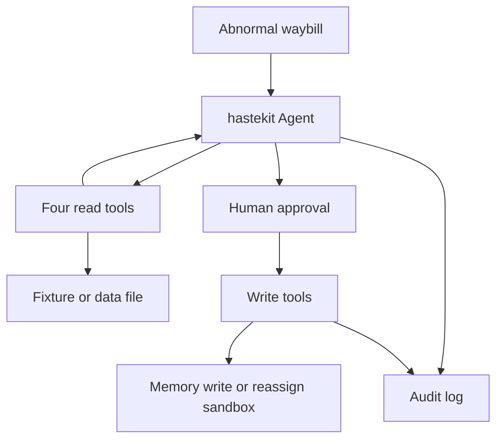

<p align="center">
  English · <a href="README.md">简体中文</a>
</p>

<p align="center">
  <picture>
    <source media="(prefers-color-scheme: dark)" srcset="docs/assets/logo-dark.svg">
    
  </picture>
</p>

<h1 align="center">waybill-guardian</h1>

<p align="center">An agent for abnormal waybills. It gathers evidence, then waits for a person.</p>

<p align="center">
  <a href="https://go.dev/dl/"></a>
  <a href="https://react.dev/"></a>
  <a href="https://nodejs.org/"></a>
  <a href="https://github.com/Duang777/waybill-guardian/actions/workflows/ci.yml"></a>
  <a href="https://github.com/Duang777/waybill-guardian/issues"></a>
  <a href="LICENSE"></a>
</p>

This repository is an entry in the 传化集团 and 动势科技 architect contest, on the AI + logistics track. The logo is original. It does not use the organizers' marks.

## For judges

After a delay, damage, or loss, waybill-guardian reads the waybill, tracking, driver, and weather, writes an attribution, and proposes reassignment, a claim, or SMS. Write actions do not run before a person confirms them. After confirmation, the server executes them under an idempotency key and appends a replayable audit log.

The agent collects waybill, tracking, driver, and weather evidence before the person decides whether to reassign, open a claim, or send a notice. Reviewers replay the audit by sequence number.

The overview calculates labor saved, anomaly closure rate, average handling time, and approval rate from the documented formulas below. The data file does not yet provide ETA baselines or cost fields, so time recovered and cost impact are explicitly unavailable instead of being filled with simulated assumptions. The three scores on the waybill page come from `deriveAssessment` in [`internal/guardian/assessment.go`](internal/guardian/assessment.go), clamped to 0 through 100. Status matching ignores case. When it is not `delivered`, the ETA score starts at 20, adds 15 for each anomaly point, then adds stop hours times 8, rounded. The road score is continuous driving hours times 5, rounded, plus 30 when the fatigue alert is set. The weather score is the highest segment alert. `none`, `normal`, `green`, and an empty value are 0. `low`, `blue`, and `yellow` are 30. `medium` and `orange` are 60. `high`, `red`, and `critical` are 90. Any other value is 20. The embedded fixture therefore shows ETA 83, road 75, and weather 0.

**The default demo is still a script.** `AGENT_MODE=demo` uses `ScenarioModel` in [`internal/agent/scenario_model.go`](internal/agent/scenario_model.go). It calls the four read tools in a fixed order, reads the driver, route, and candidate carriers from the tool results, and fills a fixed sentence template. Replacing that demo with real model inference is still open in [issue 59](https://github.com/Duang777/waybill-guardian/issues/59).

`AGENT_MODE=online` can call the OpenAI Responses API, or an OpenAI-compatible Chat Completions API. That wiring is in the tree. Issue 59 still asks for a real-model default demo, structured evidence references, and acceptance on a domestic model. Those items are still open.

`PLATFORM=mock` loads only the embedded waybill `YD2026101001` from [`internal/tools/testdata/demo.json`](internal/tools/testdata/demo.json). `PLATFORM=file` loads one JSON or CSV v1 file at startup and supports optional highway-port, vehicle, and route network entities. The page can select a waybill from that file and start a run. Writes in file mode stay on the in-memory fixture write runtime, and SMS is not actually sent.

The home page is a nationwide highway-port overview with the network, KPIs, anomaly queue, and cited operating briefs. It can start five independent runs in one batch. Selecting a waybill opens its workbench; every run keeps its own approval and SSE timeline. The current UI is still not the black and orange command center in [issue 77](https://github.com/Duang777/waybill-guardian/issues/77).

<p align="center">
  
</p>

<p align="center">
  
</p>

Both screenshots come from `npm run verify:e2e` after merging current `main`, with no Amap key, so the map is the local track. `ScenarioModel` fills the approval sentence from tool results with a fixed template.

## Architecture



`cmd/server` serves HTTP and SSE. `internal/guardian` connects the agent, approval, idempotency, and recovery. The agent runtime is hastekit `agent-sdk-go` v0.0.24.

The four read tools are `tms.get_waybill`, `tms.get_tracking`, `tms.get_driver`, and `ext.get_road_weather`. They run automatically. The three write tools are `tms.reassign`, `tms.create_claim`, and `notify.send_sms`. They pause until a person decides. The contract is [`contract.yaml`](contract.yaml).

With `PLATFORM=mock`, reads and writes use the embedded fixture. SMS is not actually sent. `PLATFORM=file` requires `STORAGE=jsonl`, `AUTH_MODE=local`, and `DATA_FILE`. Before it listens, the server loads the whole file with `filestore.Load`. Reads use that file. Writes use the in-memory fixture write runtime over the same read data. The process does not reload the file while it runs. Replacing the file requires a restart. `PLATFORM=real` starts only with PostgreSQL and JWT. Reads stay on the embedded fixture `fixture-v1`. The only write is `tms.reassign`, sent to the HTTP sandbox `tms-reassign-sandbox-v1`. That profile does not register claims or SMS. It exercises a network write and reconciliation. It is not a production TMS.

The default audit is one append-only JSONL file per run, with `seq`, `prev_hash`, and `hash`. With `STORAGE=postgres`, the business projection, audit, and outbox commit in one transaction. The timeline is SSE. Clients resume with `Last-Event-ID`.

Approval starts at `pending`. Confirm moves it to `confirmed`, reject to `rejected`, and timeout to `expired`. All writes succeeding moves it to `executed`. A partial success is `partially_failed`. A total failure is `failed`. An outcome that is not yet known is `reconciliation_required`.

## Features

The status describes the code in this repository.

| Status | Meaning |
|---|---|
| Shipped | It runs on the default branch, within the scope in the notes |
| In progress | Some code exists, and the issue acceptance criteria are not met |
| Planned | The default branch does not have this |

| Feature | Status | Notes |
|---|---|---|
| Four read tools, three write tools, human approval | Shipped | Matches [`contract.yaml`](contract.yaml). Under mock, all three writes require approval. |
| Server-generated idempotency key | Shipped | The model does not submit `effect_id` or the key. Ten concurrent calls for one key reach the platform once. See [`idempotency_test.go`](internal/idempotency/idempotency_test.go). |
| JSONL audit, hash chain, SSE replay | Shipped | The UI deduplicates by run and `seq`. |
| PostgreSQL storage | Shipped | Stores runs, approvals, effects, audit, outbox, and AES-256-GCM agent history. |
| Local identity and JWT | Shipped | `AUTH_MODE=local` listens on loopback by default; the container also checks the Host and TCP peer. `jwt` checks RS256, issuer, audience, time, tenant, role, and waybill scope. |
| Amap or a local track | Shipped | With no key, or if the SDK fails to load, the page draws local coordinates. |
| Reassign HTTP sandbox | Shipped | `tms.reassign` only. Reads stay on the fixture. Not a production TMS. |
| Online model calls | In progress | An OpenAI-compatible API can be configured. The default demo is still the script. See [issue 59](https://github.com/Duang777/waybill-guardian/issues/59). |
| File import | Shipped | `PLATFORM=file` loads JSON or CSV v1 at startup, and the page can select a waybill from the file. Writes stay on the in-memory fixture runtime. See closed [issue 60](https://github.com/Duang777/waybill-guardian/issues/60) and [`docs/file-data-source-design.md`](docs/file-data-source-design.md). |
| Highway-port overview | Shipped | The home page shows the 72-port network, KPIs, anomaly queue, operating briefs, and batch start with per-run approval. See [issue 61](https://github.com/Duang777/waybill-guardian/issues/61). |
| Apache-2.0 and dependency manifests | Shipped | The root has `LICENSE`. Transitive dependency manifests are in [`docs/licenses/`](docs/licenses/). |
| CSRF checks on non-GET requests | Planned | [Issue 64](https://github.com/Duang777/waybill-guardian/issues/64) |
| Docker Compose | Shipped | One container serves the frontend and API, with an optional PostgreSQL 17 profile. |
| GitHub Actions | Shipped | Pull requests and `main` run Go, Web, PostgreSQL, license, and image checks. |
| Command-center visual design | Planned | [Issue 77](https://github.com/Duang777/waybill-guardian/issues/77), including issues 69 through 76. |

## Demo

The script is [`docs/demo-script.md`](docs/demo-script.md). Start the stack:

```bash
./scripts/demo.sh
```

Open <http://127.0.0.1:5173> for the operating overview. Select anomalous waybills and click **交给 Agent**, or open `/waybills/:id` for one waybill. The workbench still offers **启动处置**. `POST /api/demo/trigger` starts the embedded waybill.

1. The agent reads waybill `YD2026101001`, Hangzhou to Chengdu.
2. The timeline records waybill, tracking, driver, and weather calls.
3. The script fills a fixed sentence from the tool results. In the embedded fixture the driver has driven 9 hours with a fatigue alert, 绵阳北服务区 is a 6 hour stop, and the weather alert is `none`, so the card proposes reassignment to 川行快运 and notices to the shipper and the driver. Those writes have not run yet.
4. Click **确认并执行**. The timeline shows the platform writes, and the waybill status becomes completed.
5. Use the replay control to watch from the first audit event, then click **实时** to return to the live end.
6. If the first carrier is rejected, the script proposes 蜀道联运. `npm run verify:e2e` covers three confirmations and one rejection.

A subtitled recording with no audio track:

```bash
cd web
npm run record:demo
```

The file is `web/artifacts/waybill-guardian-demo.mp4`, at 1600 by 900. That directory is gitignored. A dubbed narration is not in the repository. `RECORD_OUTPUT`, `RECORD_BACKEND_PORT`, and `RECORD_WEB_PORT` change the output path and ports.

## Quick start

### Docker

With Docker installed, one command builds the image and serves the frontend and API at
<http://127.0.0.1:8080>:

```bash
git clone https://github.com/Duang777/waybill-guardian.git
cd waybill-guardian
docker compose up --build
```

Compose publishes the application only on host loopback. The `app-data` volume stores the audit and
agent history. Use `docker compose down` to stop it, or `docker compose down --volumes` to delete the
demo data too.

To use the optional PostgreSQL 17 profile:

```bash
cp .env.example .env
docker compose up --build
```

The copied `.env` keeps the `prod` profile and PostgreSQL storage enabled on later starts. Its
database password and checkpoint key are local demo values. Replace them for a real deployment, use
`AUTH_MODE=jwt`, and run behind HTTPS. If the PostgreSQL password changes, URL-encode it in
`DATABASE_URL`.

### Local toolchain

You need Go 1.25.3 or newer, Node.js 22.12 or newer, and npm:

```bash
./scripts/demo.sh
```

If `web/node_modules/.bin/vite` is missing, the script runs `npm ci`, then builds the API and starts the web console. When both are up it prints `Waybill Guardian is ready`. `Ctrl+C` stops both processes.

Use another port and data directory:

```bash
BACKEND_PORT=18080 WEB_PORT=15173 DATA_DIR=/tmp/waybill-demo ./scripts/demo.sh
```

Checks:

```bash
go test ./...
go test -race ./...
go vet ./...
go build ./...
./scripts/check-production-fixture-literals.sh
./scripts/check-history-governance.sh
./scripts/licenses.sh
```

`scripts/licenses.sh` pins its scanners and verifies that the committed Go and Web production
dependency manifests match the lock files. Run `./scripts/licenses.sh --write` after a dependency
change.

`./scripts/test-postgres.sh` starts a temporary PostgreSQL 17 with Docker and checks migrations,
transactions, leases, encrypted history, and the browser workflow.

```bash
./scripts/test-postgres.sh
```

```bash
cd web
npm ci
npm test
npm run build
npm audit --omit=dev --audit-level=high
npm run verify:e2e
npm run verify:file-e2e
npm run verify:overview
```

GitHub Actions runs the Go race suite, recovery stability loop, PostgreSQL integration, Web,
license, and image checks on pull requests and `main`. Scheduled and manual runs also execute both
browser E2E suites and upload `web/artifacts/*.png`.

## Configuration

`./scripts/demo.sh` sets the first four variables below. Every other variable is inherited from the shell. `go run ./cmd/server` listens on `HTTP_ADDR`, default `127.0.0.1:8080`.

| Variable | Default | Meaning |
|---|---|---|
| `BACKEND_HOST` | `127.0.0.1` | API host, used by `demo.sh` |
| `BACKEND_PORT` | `8080` | API port, used by `demo.sh` |
| `WEB_HOST` | `127.0.0.1` | Web host, used by `demo.sh` |
| `WEB_PORT` | `5173` | Web port, used by `demo.sh` |
| `HTTP_ADDR` | `127.0.0.1:8080` | Server listen address. Local mode requires a loopback IP |
| `WEB_STATIC_DIR` | empty | Frontend build directory served by Go. The container uses `/app/web` |
| `ALLOW_NON_LOOPBACK_LOCAL` | `false` | Allow local mode to listen on a non-loopback IP, only for a container published on host loopback |
| `LOCAL_TRUSTED_REMOTE` | empty | Required with the previous option. The TCP peer must match this IP, hostname, or `container-gateway` |
| `DATA_DIR` | `data` | JSONL audit and hastekit history directory |
| `AGENT_MODE` | `demo` | `demo` uses `ScenarioModel`. `online` calls an external model |
| `PLATFORM` | `mock` | `mock` uses the fixture. `file` loads `DATA_FILE`. `real` uses the reassign sandbox |
| `DATA_FILE` | empty | Required for `PLATFORM=file`. One JSON or CSV v1 file |
| `MAX_CONCURRENT_RUNS` | `8` | Maximum concurrent investigation runs, from 1 through 64 |
| `EVIDENCE_STEP_MINUTES` | `8` | Estimated human minutes per evidence collection step. Must be positive |
| `STORAGE` | `jsonl` | `jsonl` or `postgres` |
| `AUTH_MODE` | `local` | `local` or `jwt` |
| `APPROVAL_TTL` | `10m` | Approval lifetime, Go duration. An invalid value falls back to the default |
| `HISTORY_RETENTION` | `168h` | Retention for finished agent history. Must be positive |
| `DEMO_STEP_DELAY` | `220ms` | Pause between scripted model steps |
| `TENANT_ID` | `local-demo` | Required explicitly in JWT mode |
| `INSTANCE_ID` | random UUID | Worker identity on PostgreSQL leases |

### File data

The v1 templates in the repository are [`data/templates/waybills-v1.json`](data/templates/waybills-v1.json) and [`data/templates/waybills-v1.csv`](data/templates/waybills-v1.csv). Validate them with the same loader the server uses:

```bash
go run ./cmd/dataimport validate --data ./data/templates/waybills-v1.csv
go run ./cmd/dataimport validate --data ./data/templates/waybills-v1.json
```

The commands print `valid dataset=template-v1 format=csv waybills=1 anomalies=1` and `valid dataset=template-v1 format=json waybills=1 anomalies=1`. Replace the path with your own v1 file. This repository does not contain `official-v1.csv`.

Start file mode after validation:

```bash
PLATFORM=file \
DATA_FILE=./data/templates/waybills-v1.csv \
DATA_DIR=/tmp/waybill-file-demo \
./scripts/demo.sh
```

Compose mounts the repository's `data/` directory read-only at `/app/data`. Run the template in the
container with:

```bash
COMPOSE_PROFILES= STORAGE=jsonl PLATFORM=file \
DATA_FILE=/app/data/templates/waybills-v1.json \
docker compose up --build
```

`PLATFORM=file` also requires `STORAGE=jsonl` and `AUTH_MODE=local`. The server loads the whole file once at startup. A syntax, reference, coordinate, or time-order error fails before the process listens. It does not reload the file while running. Replacing the file requires a restart. Fields and checks are in [`docs/file-data-source-design.md`](docs/file-data-source-design.md). The waybill selector lists the waybills in the file.

The repository also contains reproducible simulated data with 72 highway ports, 72 routes, 200
vehicles, 200 waybills, and five anomaly types:

```bash
env -u GOROOT go run ./cmd/datagenerate \
  --output ./data/simulated/waybills-v1.json \
  --waybills 200

env -u GOROOT go run ./cmd/dataimport validate \
  --data ./data/simulated/waybills-v1.json
```

`hubs`, `vehicles`, `routes`, and the corresponding waybill references are optional v1 network
extensions. If a file contains any network entity, the validator requires all three entity groups
and every reference. The simulated data is for product demonstrations and capacity checks. It is
not operational data.

### Operating overview and KPIs

`GET /api/overview` returns authorized highway ports, routes, the anomaly queue, and three cited
operating briefs. The service filters the waybill scope before calculating totals and ratios. The
brief reads aggregate data only and cannot invoke write tools.

`POST /api/runs:batch` accepts up to 20 `waybill_id` values and returns an independent result for
each one. `MAX_CONCURRENT_RUNS` limits concurrent investigations. Every accepted run has its own
`run_id`, approval record, and SSE timeline.

`GET /api/kpis?window=24h` uses these formulas:

| KPI | Formula | Result when data is missing |
|---|---|---|
| Time recovered | `sum(baseline ETA without action - ETA after action)` | `unavailable` without both ETA fields |
| Cost impact | `sum(avoided penalty - reassignment delta - handling cost)` | `unavailable` without cost fields |
| Labor saved | `successful evidence steps * EVIDENCE_STEP_MINUTES / 60` | `0` hours without evidence events |
| Anomaly closure rate | `completed or rejected anomaly runs / anomalous waybills * 100%` | `0%` without anomalous waybills |
| Average handling time | `sum(terminal time - start time) / closed runs` | `unavailable` without closed runs |
| Approval rate | `confirmed decisions / human decisions * 100%` | `unavailable` without decisions |

The service does not invent values for time recovered or cost impact. A production adapter must
provide the baseline, result, and cost fields required by those formulas.

### Online model

```bash
AGENT_MODE=online \
LLM_API_STYLE=responses \
LLM_BASE_URL=https://api.openai.com/v1 \
LLM_API_KEY=replace-me \
LLM_MODEL=gpt-5-mini \
./scripts/demo.sh
```

`LLM_API_STYLE` is `responses` or `chat_completions`. The default is `responses`. `LLM_BASE_URL` must be the API root. It must not end in `/`, and it must not include `/responses` or `/chat/completions`. Online mode configures one provider and does not enable provider fallback. A model call is attempted at most three times, including the first try.

This is still not the real-model default demo in issue 59.

### Platform

`PLATFORM=mock` does not call an external system.

`PLATFORM=real` also requires:

| Variable | Required value |
|---|---|
| `STORAGE` | `postgres` |
| `AUTH_MODE` | `jwt` |
| `REAL_PLATFORM_PROFILE` | `tms-reassign-sandbox-v1` |
| `REAL_READ_SOURCE` | `fixture-v1` |
| `TMS_SANDBOX_BASE_URL` | Sandbox root URL |
| `TMS_SANDBOX_TOKEN` | Bearer token |
| `TMS_SANDBOX_ACCOUNT` | Must equal `TENANT_ID` |

Related timeouts are `PLATFORM_REQUEST_TIMEOUT` (default `3s`), `PLATFORM_STARTUP_TIMEOUT` (default `5s`), `EFFECT_RECONCILE_HORIZON` (default `24h`), `EFFECT_RECONCILE_POLL_INTERVAL` (default `1s`), and `PLATFORM_MAX_LOOKUP_CONSISTENCY_WINDOW` (default `30s`).

### Storage, auth, and outbox

`STORAGE=postgres` requires `DATABASE_URL` and `CHECKPOINT_ENCRYPTION_KEY`. The key is a Base64 encoding of 32 bytes for AES-256. `CHECKPOINT_KEY_ID` defaults to `local-v1`.

Pool settings: `PG_MAX_CONNS` defaults to 8, `PG_MIN_CONNS` defaults to 0, `PG_STARTUP_TIMEOUT` defaults to `30s`. `RUN_LEASE_TTL` defaults to `30s`. `EFFECT_LEASE_TTL` defaults to `15s`.

`AUTH_MODE=jwt` also needs `AUTH_JWT_ISSUER`, `AUTH_JWT_AUDIENCE`, and `AUTH_JWT_PUBLIC_KEY_FILE`. The public key is a PEM-encoded RSA key. The JWT needs `sub`, `tenant_id`, `roles`, and either `waybill_all=true` or a non-empty `waybill_ids`. Roles are `viewer`, `dispatcher`, `operator`, and `event_producer`. The server does not terminate TLS. A non-loopback deployment needs an HTTPS front door.

`POST /v1/events` is registered only in PostgreSQL mode. The outbox dispatcher is off by default. `OUTBOX_ENABLED=true` requires `OUTBOX_URL` and `OUTBOX_TOKEN`. Except for a loopback test address, `OUTBOX_URL` must be HTTPS. `METRICS_ADDR`, for example `127.0.0.1:9090`, exposes Prometheus metrics at `/metrics` on a separate listener. Both require PostgreSQL.

| Variable | Default |
|---|---|
| `OUTBOX_BATCH_SIZE` | `10`, maximum 100 |
| `OUTBOX_CONCURRENCY` | `4`, maximum 100 |
| `OUTBOX_POLL_INTERVAL` | `250ms` |
| `OUTBOX_LEASE_TTL` | `30s` |
| `OUTBOX_STATS_INTERVAL` | `15s` |
| `OUTBOX_HTTP_TIMEOUT` | `10s` |

### Web

Put Amap settings in `web/.env.local`. Git ignores that file.

```dotenv
VITE_AMAP_KEY=replace-me
VITE_AMAP_SECURITY_JS_CODE=replace-me
```

`VITE_API_TARGET` is the API address for the Vite dev proxy. The default is `http://127.0.0.1:8080`. `demo.sh` sets it to the API it started.

### Delete agent history

Stop the server first. Delete local history:

```bash
rm -rf "${DATA_DIR:-data}/hastekit"
```

PostgreSQL deletion is per tenant. It also clears checkpoint pointers on finished runs:

```sql
BEGIN;
DELETE FROM waybill.agent_summaries WHERE tenant_id = :'tenant_id';
DELETE FROM waybill.agent_checkpoints WHERE tenant_id = :'tenant_id';
UPDATE waybill.runs
SET sdk_run_id = NULL, checkpoint_version = 0
WHERE tenant_id = :'tenant_id'
  AND status IN ('completed', 'rejected', 'failed', 'manual_review');
COMMIT;
```

Do not clear a run that is still active. Deleting history does not delete `waybill.audit_events`.

## Safety and compliance

Write tools set `RequiresApproval`. hastekit pauses the run at `await_approval` before the tool runs. The human decision is written to the audit first. The server then resumes the same thread. Confirm, reject, and expiry share one run lock, so only one decision is stored. Expiry resumes the agent as a rejection. The default lifetime is 10 minutes.

The model submits business arguments only. The server generates `effect_id` and the idempotency key. On resume, middleware checks `call_id`, the argument hash, and `effect_id`. Concurrent calls for the same key are merged. In the test, 10 concurrent calls reach the platform once. A recorded failure can be retried as a new attempt. If the external system succeeded and the local success event was not written, the state is indeterminate and the server does not retry automatically. A real adapter must retry safely with the same key, or look the key up.

Audit events are append-only. `seq`, `prev_hash`, and `hash` let a reader check that the chain was not edited. SSE replays from the cursor, then streams live events.

The read-tool payloads sent to the model omit phone numbers, license plates, and exact coordinates. The SMS tool receives the waybill, the recipient role, and the carrier. The server resolves the phone number and template after approval. The history guard rejects phone numbers, license plates, exact coordinates, and SMS provider parameters in model history. The operator API masks phone numbers and license plates. The map API still returns track coordinates so the console can draw the route.

`AUTH_MODE=local` listens on loopback by default and rejects a request whose Host is not a loopback
IP. The container listens on all interfaces with `ALLOW_NON_LOOPBACK_LOCAL=true`, validates the TCP
peer with `LOCAL_TRUSTED_REMOTE=container-gateway`, and publishes the Compose port only on host
loopback. The approval subject is fixed as `local-demo-reviewer`. A client-supplied `Authorization`
header or `X-Actor` header does not choose the identity.

Non-GET routes do not yet check `Origin` or `Sec-Fetch-Site`. See [issue 64](https://github.com/Duang777/waybill-guardian/issues/64).

## Open source

Direct dependencies, npm packages, and reference projects are listed in [`THIRD_PARTY_NOTICES.md`](THIRD_PARTY_NOTICES.md).

hastekit `agent-sdk-go` v0.0.24 is a Go module dependency under Apache-2.0. This repository does not copy its source.

These three projects were used to compare interaction and domain splits. None of their source files are in this repository:

- [jattiphrswan/logistics-tracker](https://github.com/jattiphrswan/logistics-tracker)
- [09karankr/port-logistics-intelligence](https://github.com/09karankr/port-logistics-intelligence)
- [dominicfinn/open_tms](https://github.com/dominicfinn/open_tms)

## Roadmap

| Issue | Topic |
|---|---|
| [59](https://github.com/Duang777/waybill-guardian/issues/59) | Run the demo on a real model, with structured evidence references |
| [60](https://github.com/Duang777/waybill-guardian/issues/60) | Closed. Load JSON or CSV v1 at startup and select a waybill on the page |
| [61](https://github.com/Duang777/waybill-guardian/issues/61) | Complete. Highway-port overview, KPIs, anomaly queue, and batch start |
| [62](https://github.com/Duang777/waybill-guardian/issues/62) | Complete. Apache-2.0, transitive dependency manifests, and `.mailmap` |
| [64](https://github.com/Duang777/waybill-guardian/issues/64) | CSRF checks for non-GET requests |
| [65](https://github.com/Duang777/waybill-guardian/issues/65) | Complete. Single-container image and Docker Compose |
| [67](https://github.com/Duang777/waybill-guardian/issues/67) | Complete. GitHub Actions |
| [68](https://github.com/Duang777/waybill-guardian/issues/68) | Still open. This page has the diagram, KPI formulas, demo entry, and file checks. A dubbed video is still open |
| [77](https://github.com/Duang777/waybill-guardian/issues/77) | Frontend visual work, including issues 69 through 76 |

The production handling path is [issue 44](https://github.com/Duang777/waybill-guardian/issues/44).

The social preview image is [`docs/assets/social-preview.png`](docs/assets/social-preview.png), at 1280 by 640. GitHub's repository Social preview is a separate upload. This file does not become that image by itself.

## License

This project uses the [Apache License 2.0](LICENSE). Transitive Go and Web dependency manifests are
in [`docs/licenses/`](docs/licenses/). External model and map service terms are recorded in
[`THIRD_PARTY_NOTICES.md`](THIRD_PARTY_NOTICES.md).

The repository does not rewrite existing Git history. `.mailmap` makes local commands such as
`git shortlog` display old company-email commits under the maintainer's personal identity. It does
not change commit objects or SHAs. Future commits use a personal or GitHub noreply address.

## Further reading

- Architecture and recovery: [docs/RFC-001.md](docs/RFC-001.md)
- Real platform adapter: [docs/RFC-002.md](docs/RFC-002.md)
- Reassign sandbox: [docs/real-write-adapter-design.md](docs/real-write-adapter-design.md)
- File data source: [docs/file-data-source-design.md](docs/file-data-source-design.md)
- Agent history: [docs/history-governance.md](docs/history-governance.md)
- Module index: [AGENTS.md](AGENTS.md)
