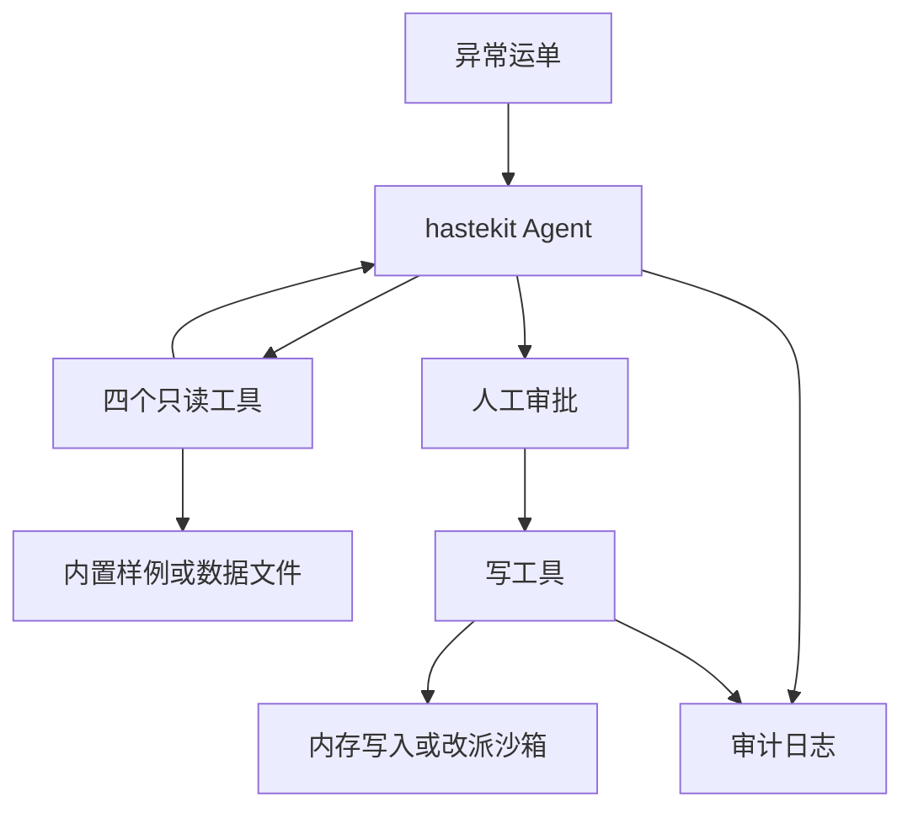

<p align="center">
  <a href="README.en.md">English</a> · 简体中文
</p>

<p align="center">
  <picture>
    <source media="(prefers-color-scheme: dark)" srcset="docs/assets/logo-dark.svg">
    
  </picture>
</p>

<h1 align="center">waybill-guardian</h1>

<p align="center">异常运单处置 Agent。先取证，再请人确认。</p>

<p align="center">
  <a href="https://go.dev/dl/"></a>
  <a href="https://react.dev/"></a>
  <a href="https://nodejs.org/"></a>
  <a href="https://github.com/Duang777/waybill-guardian/actions/workflows/ci.yml"></a>
  <a href="https://github.com/Duang777/waybill-guardian/issues"></a>
  <a href="LICENSE"></a>
</p>

传化集团与动势科技的「AI 重构产业架构师大赛」，赛道是 AI+物流。本仓库是参赛项目。标志是原创图形，没有使用主办方商标。

## 给评委

延误、破损或丢件发生后，waybill-guardian 读取运单、轨迹、司机和天气，整理归因，并给出改派、赔付或短信方案。写操作在人工确认前不会执行。确认之后，服务按幂等键回写，并把全过程写入可以校验、可以回放的审计日志。

调度员少做的是在几个系统之间来回查证据。人仍然决定是否改派、是否赔付、是否发通知。复核时按审计序号重放。

经营总览按下文口径计算人力节省、异常闭环率、平均处置时长和审批通过率。数据文件还没有时效基线与成本字段，因此时效挽回和成本影响会明确显示为不可用，不会用仿真假设补值。单运单页面的三项风险分由 [`internal/guardian/assessment.go`](internal/guardian/assessment.go) 的 `deriveAssessment` 计算，并限制在 0 到 100。运单状态的比较不区分大小写。状态不是 `delivered` 时，ETA 分先取 20，每个异常点再加 15，再加上停留小时乘以 8 后四舍五入。路况分是连续驾驶小时乘以 5 后四舍五入，疲劳预警再加 30。天气分取各段预警的最大值。`none`、`normal`、`green` 和空值为 0，`low`、`blue`、`yellow` 为 30，`medium`、`orange` 为 60，`high`、`red`、`critical` 为 90，其余为 20。内置样例因此显示 ETA 83、路况 75、天气 0。

**默认演示仍是脚本。** `AGENT_MODE=demo` 使用 [`internal/agent/scenario_model.go`](internal/agent/scenario_model.go) 里的 `ScenarioModel`。它按固定顺序调用四个只读工具，从工具结果读取司机、路线和候选承运商，再用固定句子模板写出归因。把演示改成真实模型推理，见仍开放的 [issue 59](https://github.com/Duang777/waybill-guardian/issues/59)。

`AGENT_MODE=online` 可以调用 OpenAI Responses API，或 OpenAI 兼容的 Chat Completions API。这是已经接上的调用路径。issue 59 还要求默认演示走真实推理、结构化证据引用，以及国产模型验收。这些还没有做。

默认 `PLATFORM=mock` 只加载内置运单 `YD2026101001`，数据在 [`internal/tools/testdata/demo.json`](internal/tools/testdata/demo.json)。`PLATFORM=file` 在启动时加载一份 JSON 或 CSV v1，支持可选的公路港、车辆和线路网络。页面可以选择文件中的运单并启动处置。文件模式下的写操作仍走内存中的 fixture 写入运行时，短信不会真正发出。

首页是全国公路港经营总览，显示网络、KPI、异常队列和带统计引用的经营简报，并支持一次启动 5 个独立 run。点击运单进入单运单工作台，每个 run 仍保留独立审批和 SSE 时间线。当前界面还不是黑橙指挥中心，那是 [issue 77](https://github.com/Duang777/waybill-guardian/issues/77)。

<p align="center">
  
</p>

<p align="center">
  
</p>

上面两张图来自合并当前 `main` 之后的 `npm run verify:e2e`，没有配置高德 key，所以地图显示本地轨迹。审批卡上的归因句子由 `ScenarioModel` 用工具结果套固定模板生成。

## 架构



`cmd/server` 提供 HTTP 和 SSE。`internal/guardian` 串起 Agent、审批、幂等和恢复。Agent 运行时是 hastekit `agent-sdk-go` v0.0.24。

四个只读工具是 `tms.get_waybill`、`tms.get_tracking`、`tms.get_driver`、`ext.get_road_weather`。它们自动执行。三个写工具是 `tms.reassign`、`tms.create_claim`、`notify.send_sms`。它们在执行前暂停，等人工决定。契约在 [`contract.yaml`](contract.yaml)。

默认 `PLATFORM=mock` 时，读和写都走内置样例。短信不会真正发出。`PLATFORM=file` 要求 `STORAGE=jsonl`、`AUTH_MODE=local` 和 `DATA_FILE`。服务在监听端口前用 `filestore.Load` 读入整份文件，读路径使用这份文件，写路径使用同一份读数据上的内存 fixture 写入运行时。运行中不会热更新，换文件要重启。`PLATFORM=real` 必须同时使用 PostgreSQL 和 JWT。读路径仍是内置样例 `fixture-v1`。写路径只有 `tms.reassign`，发到 HTTP 沙箱 `tms-reassign-sandbox-v1`。这个 profile 不注册赔付和短信。它用来验证网络写入和对账。它不是生产 TMS。

审计默认是每个 run 一份 append-only JSONL，带 `seq`、`prev_hash` 和 `hash`。`STORAGE=postgres` 时，业务投影、审计和 outbox 在同一事务里提交。时间线用 SSE，客户端可以用 `Last-Event-ID` 续传。

审批从 `pending` 开始。确认后是 `confirmed`，驳回是 `rejected`，超时是 `expired`。写操作全部成功后是 `executed`。部分成功是 `partially_failed`，全部失败是 `failed`。结果还不能确定时是 `reconciliation_required`。

## 能力

状态描述本仓库当前代码。

| 状态 | 含义 |
|---|---|
| 已交付 | 默认分支可以运行，范围写在说明里 |
| 进行中 | 有一部分代码，issue 的验收标准还没达到 |
| 计划中 | 默认分支没有这项能力 |

| 能力 | 状态 | 说明 |
|---|---|---|
| 四个只读工具，三个写工具，人工审批 | 已交付 | 与 [`contract.yaml`](contract.yaml) 对齐。mock 下三个写操作都要审批。 |
| 服务端幂等键 | 已交付 | 模型不提交 `effect_id` 或幂等键。同一键的 10 个并发调用只会进入 platform 一次，见 [`idempotency_test.go`](internal/idempotency/idempotency_test.go)。 |
| JSONL 审计、哈希链、SSE 回放 | 已交付 | 前端按 run 和 `seq` 去重。 |
| PostgreSQL 存储 | 已交付 | 保存 run、审批、effect、审计、outbox，以及 AES-256-GCM 加密的 Agent history。 |
| 本地身份和 JWT | 已交付 | `AUTH_MODE=local` 默认监听 loopback；容器额外校验 Host 和 TCP 对端。`jwt` 校验 RS256、issuer、audience、时效、租户、角色和运单范围。 |
| 高德地图或本地轨迹 | 已交付 | 没有 key，或 SDK 加载失败时，页面改用本地坐标。 |
| 改派 HTTP 沙箱 | 已交付 | 仅 `tms.reassign`。读仍是内置样例。不是生产 TMS。 |
| 在线模型调用 | 进行中 | 可以配置 OpenAI 兼容 API。默认演示仍是脚本。验收标准见 [issue 59](https://github.com/Duang777/waybill-guardian/issues/59)。 |
| 文件导入 | 已交付 | `PLATFORM=file` 在启动时加载 JSON 或 CSV v1，页面可以选择其中的运单。写操作留在内存 fixture 运行时。见已关闭的 [issue 60](https://github.com/Duang777/waybill-guardian/issues/60) 和 [`docs/file-data-source-design.md`](docs/file-data-source-design.md)。 |
| 公路港总览 | 已交付 | 首页展示 72 港网络、KPI、异常队列和经营简报，并支持批量启动后逐单审批。见 [issue 61](https://github.com/Duang777/waybill-guardian/issues/61)。 |
| Apache-2.0 与依赖许可清单 | 已交付 | 根目录含 `LICENSE`，传递依赖清单位于 [`docs/licenses/`](docs/licenses/)。 |
| 非 GET 请求的 CSRF 检查 | 计划中 | [issue 64](https://github.com/Duang777/waybill-guardian/issues/64) |
| Docker Compose | 已交付 | 单容器提供前端和 API，可选 PostgreSQL 17 profile。 |
| GitHub Actions | 已交付 | PR 和 main 运行 Go、Web、PostgreSQL、许可与镜像检查。 |
| 指挥中心视觉 | 计划中 | [issue 77](https://github.com/Duang777/waybill-guardian/issues/77)，包含 issue 69 到 76。 |

## 演示

讲稿在 [`docs/demo-script.md`](docs/demo-script.md)。启动：

```bash
./scripts/demo.sh
```

打开 <http://127.0.0.1:5173> 查看经营总览。选择异常运单后点击 **交给 Agent**，或下钻到 `/waybills/:id` 处理单张运单。单运单工作台仍可点击 **启动处置**。`POST /api/demo/trigger` 会启动内置运单。

1. Agent 查询杭州到成都运单 `YD2026101001`。
2. 时间线记下运单、轨迹、司机和天气四次工具调用。
3. 脚本把工具结果套进固定句子。内置样例里连续驾驶 9 小时并有疲劳预警，绵阳北服务区停留 6 小时，天气预警是 `none`，所以审批卡建议改派到川行快运，再通知货主和司机。这三个写操作此时还没有执行。
4. 点击 **确认并执行**。时间线出现平台写入，运单状态变为处置完成。
5. 用回放控件从第一条审计事件再看一遍，然后点 **实时** 回到末尾。
6. 如果驳回首选承运商，脚本会改提蜀道联运。`npm run verify:e2e` 覆盖了确认三次和驳回一次。

带中文字幕、没有音轨的录像：

```bash
cd web
npm run record:demo
```

输出在 `web/artifacts/waybill-guardian-demo.mp4`，1600×900。这个目录被 git 忽略。正式配音还不在仓库里。可用 `RECORD_OUTPUT`、`RECORD_BACKEND_PORT` 和 `RECORD_WEB_PORT` 改输出路径和端口。

## 快速开始

### Docker

只需安装 Docker。以下命令构建单个应用镜像，并在
<http://127.0.0.1:8080> 同时提供前端和 API：

```bash
git clone https://github.com/Duang777/waybill-guardian.git
cd waybill-guardian
docker compose up --build
```

应用端口只发布到宿主机 loopback。审计与 Agent history 保存在 `app-data` 命名卷中。
停止服务使用 `docker compose down`；需要同时删除演示数据时使用
`docker compose down --volumes`。

可选的 PostgreSQL 17 演示使用 `prod` profile：

```bash
cp .env.example .env
docker compose up --build
```

复制后的 `.env` 会通过 `COMPOSE_PROFILES=prod` 持续启用 PostgreSQL，避免后续启动切回
JSONL。示例中的数据库密码和 checkpoint key 只供本机演示。真实部署必须替换这些值，改用
`AUTH_MODE=jwt`，并在 HTTPS 入口后运行服务。修改 PostgreSQL 密码时，还要把
`DATABASE_URL` 中的密码改为对应的 URL 编码值。

### 本地工具链

需要 Go 1.25.3 或更高版本，以及 Node.js 22.12 或更高版本。本次核对使用 Go 1.25.3 和
Node.js 24.16.0。`./scripts/demo.sh` 能把 API 和前端拉起来，`npm run verify:e2e` 已通过。

```bash
./scripts/demo.sh
```

脚本在缺少 `web/node_modules/.bin/vite` 时先执行 `npm ci`，然后编译 API 并启动前端。就绪后打印 `Waybill Guardian is ready`。`Ctrl+C` 会停掉两个进程。

换端口和数据目录：

```bash
BACKEND_PORT=18080 WEB_PORT=15173 DATA_DIR=/tmp/waybill-demo ./scripts/demo.sh
```

检查命令：

```bash
go test ./...
go test -race ./...
go vet ./...
go build ./...
./scripts/check-production-fixture-literals.sh
./scripts/check-history-governance.sh
./scripts/licenses.sh
```

`scripts/licenses.sh` 固定依赖扫描器版本，并核对已提交的 Go 和 Web 生产依赖许可清单。
依赖变化后运行 `./scripts/licenses.sh --write` 更新清单，再提交生成结果。

`./scripts/test-postgres.sh` 用 Docker 启动临时 PostgreSQL 17，检查迁移、事务、租约、加密
history 和浏览器完整流程。

```bash
./scripts/test-postgres.sh
```

前端检查和浏览器流程：

```bash
cd web
npm ci
npm test
npm run build
npm run verify:e2e
npm run verify:file-e2e
npm run verify:overview
```

GitHub Actions 会在 pull request 和 `main` 推送上运行 Go race、恢复稳定性、PostgreSQL
17、Web、许可证与 Docker 检查。浏览器 E2E 每日定时运行，也可在 Actions 页面手动触发；
运行结果会上传 `web/artifacts/*.png`。

## 配置

`./scripts/demo.sh` 会读取下面四项，并默认从前端地址生成 `ALLOWED_ORIGINS`；其余变量从当前 shell 继承。直接运行 `go run ./cmd/server` 时，监听地址用 `HTTP_ADDR`，默认 `127.0.0.1:8080`。

| 变量 | 默认值 | 说明 |
|---|---|---|
| `BACKEND_HOST` | `127.0.0.1` | API 监听地址，只给 `demo.sh` 使用 |
| `BACKEND_PORT` | `8080` | API 端口，只给 `demo.sh` 使用 |
| `WEB_HOST` | `127.0.0.1` | 前端监听地址，只给 `demo.sh` 使用 |
| `WEB_PORT` | `5173` | 前端端口，只给 `demo.sh` 使用 |
| `HTTP_ADDR` | `127.0.0.1:8080` | 服务监听地址。local 模式必须是 loopback IP |
| `ALLOWED_ORIGINS` | 空 | 逗号分隔的可信浏览器来源，格式为精确的 `scheme://host[:port]`。仅跨来源部署需要配置 |
| `WEB_STATIC_DIR` | 空 | 由 Go 服务托管的前端构建目录。容器内是 `/app/web` |
| `ALLOW_NON_LOOPBACK_LOCAL` | `false` | 允许 local 模式监听非 loopback IP，只供端口绑定到宿主机 loopback 的容器使用 |
| `LOCAL_TRUSTED_REMOTE` | 空 | 上一项为 `true` 时必填。请求 TCP 对端必须匹配该 IP、主机名或 `container-gateway` |
| `DATA_DIR` | `data` | JSONL 审计和 hastekit history 目录 |
| `AGENT_MODE` | `demo` | `demo` 使用 `ScenarioModel`。`online` 调用外部模型 |
| `PLATFORM` | `mock` | `mock` 使用内置样例。`file` 加载 `DATA_FILE`。`real` 使用改派沙箱，见下文 |
| `DATA_FILE` | 空 | `PLATFORM=file` 时必填，指向一份 JSON 或 CSV v1 |
| `MAX_CONCURRENT_RUNS` | `8` | 同时执行调查阶段的 run 数量，范围 1 到 64 |
| `EVIDENCE_STEP_MINUTES` | `8` | 人工完成一次证据采集的估算分钟数，必须为正数 |
| `STORAGE` | `jsonl` | `jsonl` 或 `postgres` |
| `AUTH_MODE` | `local` | `local` 或 `jwt` |
| `APPROVAL_TTL` | `10m` | 审批有效期，Go duration。非法值会退回默认值 |
| `HISTORY_RETENTION` | `168h` | 已结束 Agent history 的保留期，必须为正数 |
| `DEMO_STEP_DELAY` | `220ms` | 脚本模型每一步的等待 |
| `TENANT_ID` | `local-demo` | JWT 模式必须显式设置 |
| `INSTANCE_ID` | 随机 UUID | PostgreSQL 租约里的 worker 身份 |

### 文件数据

仓库里的 v1 模板是 [`data/templates/waybills-v1.json`](data/templates/waybills-v1.json) 和 [`data/templates/waybills-v1.csv`](data/templates/waybills-v1.csv)。用与服务端相同的 loader 校验：

```bash
go run ./cmd/dataimport validate --data ./data/templates/waybills-v1.csv
go run ./cmd/dataimport validate --data ./data/templates/waybills-v1.json
```

两条命令分别打印 `valid dataset=template-v1 format=csv waybills=1 anomalies=1` 和 `valid dataset=template-v1 format=json waybills=1 anomalies=1`。把路径换成自己的 v1 文件即可。仓库里没有 `official-v1.csv`。

校验通过后启动文件模式：

```bash
PLATFORM=file \
DATA_FILE=./data/templates/waybills-v1.csv \
DATA_DIR=/tmp/waybill-file-demo \
./scripts/demo.sh
```

Compose 将仓库的 `data/` 目录只读挂载到 `/app/data`。容器内运行模板数据：

```bash
COMPOSE_PROFILES= STORAGE=jsonl PLATFORM=file \
DATA_FILE=/app/data/templates/waybills-v1.json \
docker compose up --build
```

`PLATFORM=file` 还要求 `STORAGE=jsonl` 和 `AUTH_MODE=local`。服务启动时一次性加载完整文件。语法、引用、坐标或时间顺序错误会在监听端口前失败。运行期间不会热更新，替换文件后需要重启。字段和校验规则见 [`docs/file-data-source-design.md`](docs/file-data-source-design.md)。页面上的运单选择器列出文件中的运单。

仓库还提供固定生成规则的非官方仿真数据，包含 72 个公路港、72 条线路、200 台车辆、200 张运单和 5 类异常：

```bash
env -u GOROOT go run ./cmd/datagenerate \
  --output ./data/simulated/waybills-v1.json \
  --waybills 200

env -u GOROOT go run ./cmd/dataimport validate \
  --data ./data/simulated/waybills-v1.json
```

`hubs`、`vehicles`、`routes` 以及运单上的港口、线路、车辆引用是 v1 的可选网络扩展。
一旦文件提供任一网络实体，校验器会要求三类实体和全部引用同时完整，避免聚合视图读取到
半套拓扑。仿真数据只用于产品演示和容量验证，不代表真实经营数据。

### 经营总览和 KPI

`GET /api/overview` 返回授权范围内的港口、线路、异常队列和三条经营简报。服务先按
`waybill_id` 授权范围过滤，再计算所有总数和比例。简报只读取聚合结果，不调用写工具。

`POST /api/runs:batch` 接受最多 20 个 `waybill_id`。服务为每个运单调用一次 `StartRun`，
并返回逐项成功或失败结果。`MAX_CONCURRENT_RUNS` 限制同时执行的调查任务。每个已接受的
run 使用独立的 `run_id`、审批记录和 SSE 时间线。

`GET /api/kpis?window=24h` 使用以下口径。窗口结束时间取授权范围内最新异常运单的
`last_recorded_at`。如果审计事件更新，则使用较新的审计时间。

| KPI | 公式 | 数据不足时的结果 |
|---|---|---|
| 时效挽回 | `sum(不处置预测 ETA - 处置后 ETA)` | 缺少两个 ETA 字段时返回 `unavailable` |
| 成本影响 | `sum(避免违约金 - 改派差价 - 处置成本)` | 缺少价格和成本字段时返回 `unavailable` |
| 人力节省 | `成功自动证据采集步数 * EVIDENCE_STEP_MINUTES / 60` | 没有采集事件时返回 `0` 小时 |
| 异常闭环率 | `已完成或已驳回处置的异常运单数 / 窗口内异常运单数 * 100%` | 没有异常运单时返回 `0%` |
| 平均处置时长 | `sum(终态时间 - 启动时间) / 窗口内闭环 run 数` | 没有闭环 run 时返回 `unavailable` |
| 人工审批通过率 | `人工确认数 / 人工决定数 * 100%` | 没有人工决定时返回 `unavailable` |

时效挽回和成本影响不会用仿真假设补值。接入正式数据后，adapter 必须提供计算公式所需的
基线、结果和成本字段。

### 在线模型

```bash
AGENT_MODE=online \
LLM_API_STYLE=responses \
LLM_BASE_URL=https://api.openai.com/v1 \
LLM_API_KEY=replace-me \
LLM_MODEL=gpt-5-mini \
./scripts/demo.sh
```

`LLM_API_STYLE` 可以是 `responses` 或 `chat_completions`，默认 `responses`。`LLM_BASE_URL` 必须是 API 根路径，不能以 `/` 结尾，也不能带上 `/responses` 或 `/chat/completions`。在线模式只配置一个 provider，没有 provider fallback。一次模型调用最多尝试三次，包含第一次。

这仍不是 issue 59 里的默认真实推理演示。

### 平台

`PLATFORM=mock` 不访问外部系统。

`PLATFORM=real` 还要求：

| 变量 | 要求 |
|---|---|
| `STORAGE` | `postgres` |
| `AUTH_MODE` | `jwt` |
| `REAL_PLATFORM_PROFILE` | `tms-reassign-sandbox-v1` |
| `REAL_READ_SOURCE` | `fixture-v1` |
| `TMS_SANDBOX_BASE_URL` | 沙箱根地址 |
| `TMS_SANDBOX_TOKEN` | Bearer token |
| `TMS_SANDBOX_ACCOUNT` | 必须等于 `TENANT_ID` |

相关超时有 `PLATFORM_REQUEST_TIMEOUT`（默认 `3s`）、`PLATFORM_STARTUP_TIMEOUT`（默认 `5s`）、`EFFECT_RECONCILE_HORIZON`（默认 `24h`）、`EFFECT_RECONCILE_POLL_INTERVAL`（默认 `1s`）和 `PLATFORM_MAX_LOOKUP_CONSISTENCY_WINDOW`（默认 `30s`）。

### 存储、认证和 outbox

`STORAGE=postgres` 时必须提供 `DATABASE_URL` 和 `CHECKPOINT_ENCRYPTION_KEY`。后者是 Base64 编码的 32 字节 AES-256 key。`CHECKPOINT_KEY_ID` 默认 `local-v1`。

连接池：`PG_MAX_CONNS` 默认 8，`PG_MIN_CONNS` 默认 0，`PG_STARTUP_TIMEOUT` 默认 `30s`。`RUN_LEASE_TTL` 默认 `30s`，`EFFECT_LEASE_TTL` 默认 `15s`。

`AUTH_MODE=jwt` 还要 `AUTH_JWT_ISSUER`、`AUTH_JWT_AUDIENCE` 和 `AUTH_JWT_PUBLIC_KEY_FILE`。公钥是 PEM 编码的 RSA 公钥。JWT 需要 `sub`、`tenant_id`、`roles`，以及 `waybill_all=true` 或非空 `waybill_ids`。角色可以是 `viewer`、`dispatcher`、`operator`、`event_producer`。服务不终止 TLS。非 loopback 部署要放在 HTTPS 入口后面。

`POST /v1/events` 只在 PostgreSQL 模式注册。outbox dispatcher 默认关闭。`OUTBOX_ENABLED=true` 时必须提供 `OUTBOX_URL` 和 `OUTBOX_TOKEN`。除 loopback 测试地址外，`OUTBOX_URL` 必须是 HTTPS。`METRICS_ADDR` 例如 `127.0.0.1:9090`，在独立端口的 `/metrics` 暴露 Prometheus 指标。这两项都要求 PostgreSQL。

| 变量 | 默认值 |
|---|---|
| `OUTBOX_BATCH_SIZE` | `10`，最大 100 |
| `OUTBOX_CONCURRENCY` | `4`，最大 100 |
| `OUTBOX_POLL_INTERVAL` | `250ms` |
| `OUTBOX_LEASE_TTL` | `30s` |
| `OUTBOX_STATS_INTERVAL` | `15s` |
| `OUTBOX_HTTP_TIMEOUT` | `10s` |

### 前端

把高德配置写进 `web/.env.local`。该文件已被 git 忽略。

```dotenv
VITE_AMAP_KEY=replace-me
VITE_AMAP_SECURITY_JS_CODE=replace-me
```

`VITE_API_TARGET` 是 Vite 开发代理的 API 地址，默认 `http://127.0.0.1:8080`。`demo.sh` 会把它设成当前 API。

### 删除 Agent history

先停掉服务。删除本地 history：

```bash
rm -rf "${DATA_DIR:-data}/hastekit"
```

PostgreSQL 按租户删除 history，并清掉已结束 run 的 checkpoint 指针：

```sql
BEGIN;
DELETE FROM waybill.agent_summaries WHERE tenant_id = :'tenant_id';
DELETE FROM waybill.agent_checkpoints WHERE tenant_id = :'tenant_id';
UPDATE waybill.runs
SET sdk_run_id = NULL, checkpoint_version = 0
WHERE tenant_id = :'tenant_id'
  AND status IN ('completed', 'rejected', 'failed', 'manual_review');
COMMIT;
```

不要清理仍在运行的 run。删除 history 不会删除 `waybill.audit_events`。

## 安全与合规

写工具带有 `RequiresApproval`。hastekit 在工具执行前把 run 停在 `await_approval`。人工决定先写入审计，服务再用同一个 thread 恢复。确认、驳回和超时争用同一把 run 锁，所以只会落下一种决定。超时按驳回恢复 Agent。默认有效期是 10 分钟。

模型只提交业务参数。服务端生成 `effect_id` 和幂等键。middleware 在恢复执行时核对 `call_id`、参数哈希和 `effect_id`。同一幂等键的并发调用会合并。测试里 10 个并发调用只进入 platform 一次。已经失败的调用可以按新的 attempt 重试。如果外部系统已经成功，但本地成功事件还没写上，状态是 indeterminate，服务不会自动重试。真实 adapter 必须能按同一个键重试，或按键查询结果。

审计事件追加写入。`seq`、`prev_hash` 和 `hash` 用来检查这条链有没有被改过。SSE 先按游标回放，再推 live 事件。

读工具返回给模型的字段不包括电话、车牌和精确坐标。短信工具只接收运单、接收方角色和承运商。电话和模板在审批之后由服务端解析。history guard 拒绝把电话、车牌、精确坐标和短信供应商参数写进模型 history。运营接口里的电话和车牌会打码。地图接口仍会返回轨迹坐标，供控制台画线。

`AUTH_MODE=local` 默认只监听 loopback IP，并拒绝 Host 不是 loopback IP 的请求。容器通过
`ALLOW_NON_LOOPBACK_LOCAL=true` 监听通配地址，同时用
`LOCAL_TRUSTED_REMOTE=container-gateway` 校验 TCP 对端。Compose 只把端口发布到宿主机
loopback。审批主体固定为 `local-demo-reviewer`。客户端送来的 `Authorization` 和
`X-Actor` 不决定身份。

API 的非安全方法由 Go 标准库 `CrossOriginProtection` 校验 `Sec-Fetch-Site` 和 `Origin`。
同源请求、`ALLOWED_ORIGINS` 中精确匹配的来源，以及不带浏览器来源头的 CLI/服务调用会
放行；其他跨站浏览器请求返回 403。审批确认、驳回和演示触发还要求
`Content-Type: application/json`；无参数请求发送 `{}`。

## 开源声明

直接依赖、npm 包和参考项目写在 [`THIRD_PARTY_NOTICES.md`](THIRD_PARTY_NOTICES.md)。

hastekit `agent-sdk-go` v0.0.24 以 Go module 引入，许可证是 Apache-2.0。本仓库没有复制它的源码。

下面三个项目只用来比较交互和领域划分，没有源文件进入本仓库：

- [jattiphrswan/logistics-tracker](https://github.com/jattiphrswan/logistics-tracker)
- [09karankr/port-logistics-intelligence](https://github.com/09karankr/port-logistics-intelligence)
- [dominicfinn/open_tms](https://github.com/dominicfinn/open_tms)

## 路线图

| 议题 | 内容 |
|---|---|
| [59](https://github.com/Duang777/waybill-guardian/issues/59) | 演示改为真实模型推理，补结构化证据引用 |
| [60](https://github.com/Duang777/waybill-guardian/issues/60) | 已关闭。启动时加载 JSON 或 CSV v1，并在页面上选择运单 |
| [61](https://github.com/Duang777/waybill-guardian/issues/61) | 已完成。多公路港总览、KPI、异常队列和批量启动 |
| [62](https://github.com/Duang777/waybill-guardian/issues/62) | 已完成。Apache-2.0、传递依赖清单和 `.mailmap` |
| [64](https://github.com/Duang777/waybill-guardian/issues/64) | 非 GET 请求的 CSRF 检查 |
| [65](https://github.com/Duang777/waybill-guardian/issues/65) | 已完成。单容器镜像和 Docker Compose |
| [67](https://github.com/Duang777/waybill-guardian/issues/67) | 已完成。GitHub Actions |
| [68](https://github.com/Duang777/waybill-guardian/issues/68) | 仍开放。本页已有架构图、KPI 口径、演示入口和文件校验命令，正式配音视频仍未完成 |
| [77](https://github.com/Duang777/waybill-guardian/issues/77) | 前端视觉，含 issue 69 到 76 |

生产化处置链路见 [issue 44](https://github.com/Duang777/waybill-guardian/issues/44)。

社交预览图在 [`docs/assets/social-preview.png`](docs/assets/social-preview.png)，尺寸 1280×640。GitHub 仓库设置里的 Social preview 需要单独上传，这个文件不会自动变成那张图。

## 许可证

项目使用 [Apache License 2.0](LICENSE)。Go 和 Web 传递依赖的许可清单位于
[`docs/licenses/`](docs/licenses/)，外部模型与地图服务条款记录在
[`THIRD_PARTY_NOTICES.md`](THIRD_PARTY_NOTICES.md)。

仓库不重写已有 Git 历史。`.mailmap` 仅让 `git shortlog` 等本地 Git 命令把已有公司邮箱
统一显示为维护者的个人身份，原始 commit 对象和 SHA 不变。后续提交使用个人邮箱或 GitHub
noreply 邮箱，避免继续把公司邮箱写入公开历史。

## 延伸阅读

- 架构和恢复：[docs/RFC-001.md](docs/RFC-001.md)
- 真实平台接入：[docs/RFC-002.md](docs/RFC-002.md)
- 改派沙箱：[docs/real-write-adapter-design.md](docs/real-write-adapter-design.md)
- 文件数据源：[docs/file-data-source-design.md](docs/file-data-source-design.md)
- Agent history：[docs/history-governance.md](docs/history-governance.md)
- 模块索引：[AGENTS.md](AGENTS.md)
